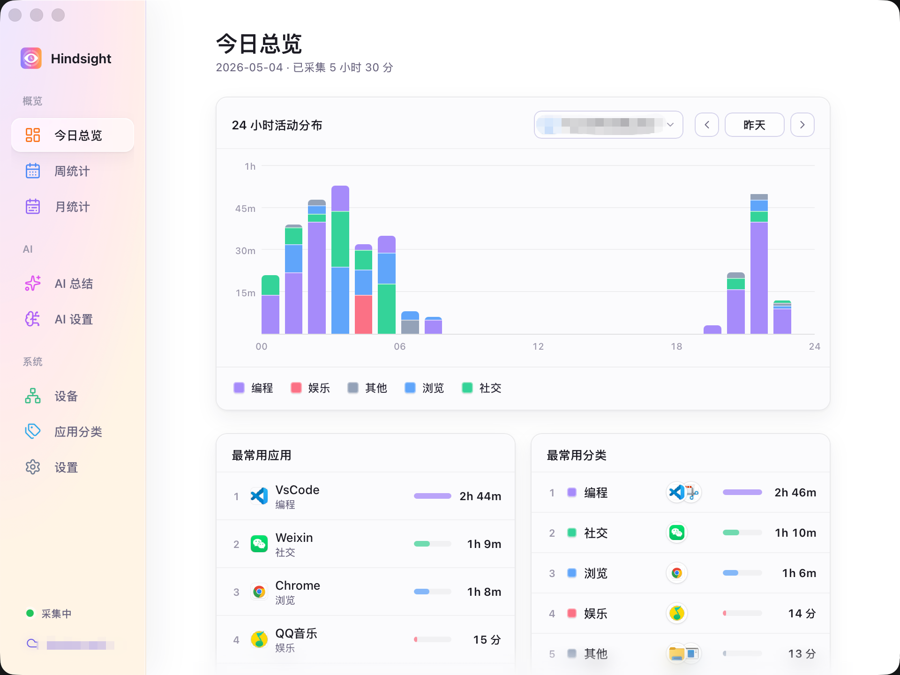
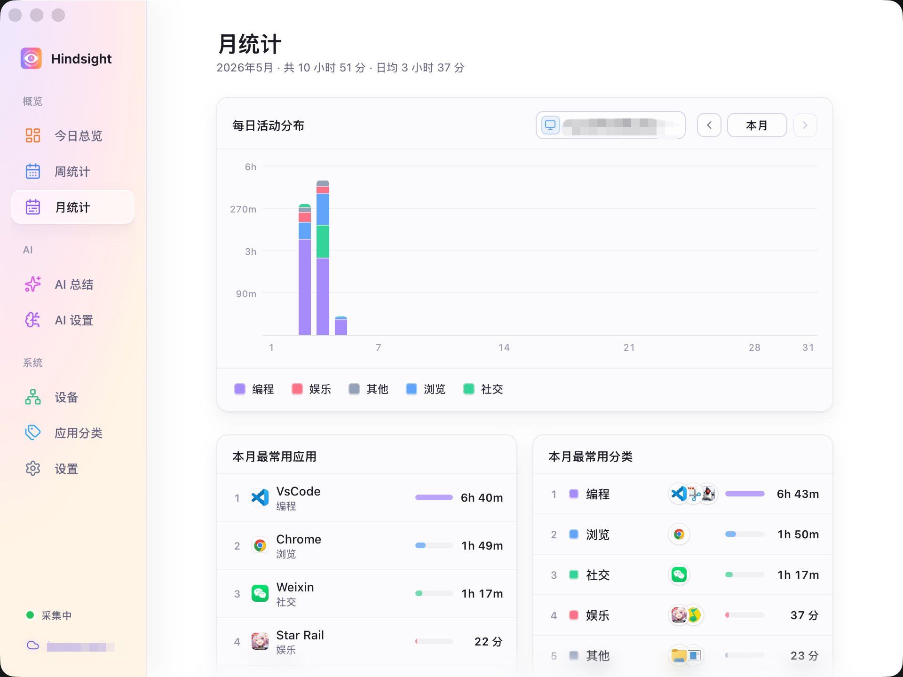
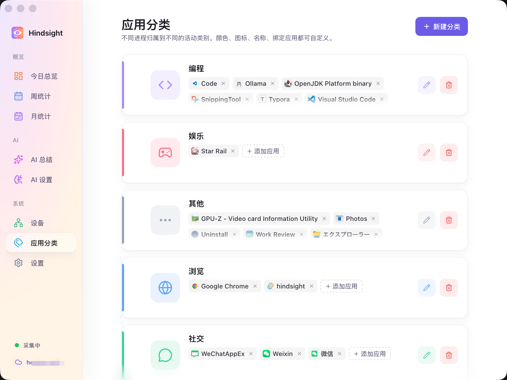
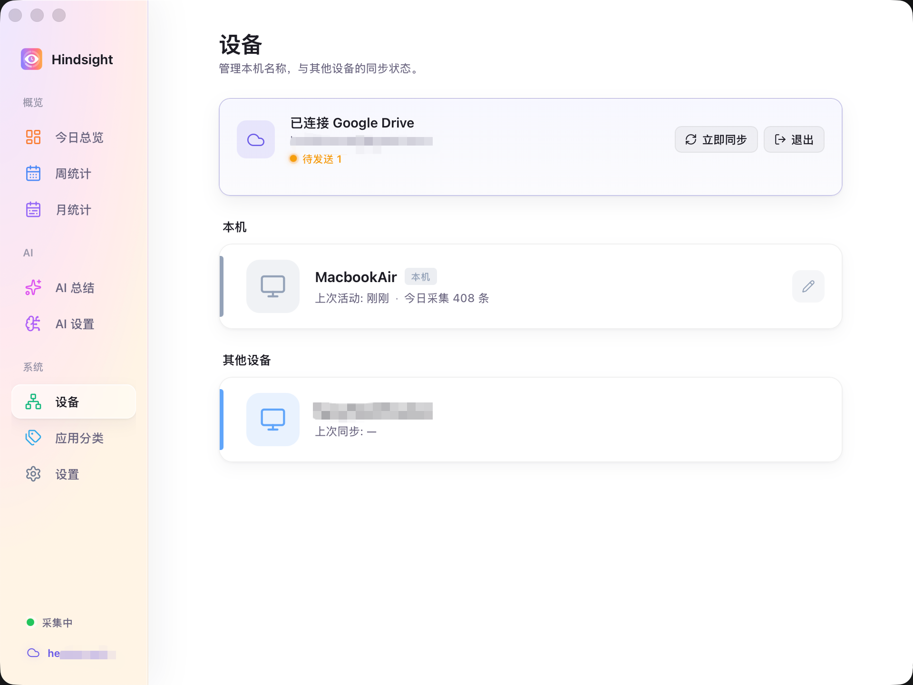

  

<h1 align="center">Hindsight</h1>

  <i>A local activity tracker for your computer — Track the apps you used throughout the day (with optional cloud sync)</i>

  <a href="README.md">中文</a> · <a href="README.en.md">English</a> · <a href="README.ja.md">日本語</a>

  
  
  
  

---

## Key Features

- 👁️ **Automatic Tracking** — Runs silently in the background, automatically detects and logs your app usage in real time
- 📊 **Time Visualization** — View app usage patterns with hourly histograms and ranking leaderboards
- 📸 **Screenshot Review** — Optional screen snapshots let you see exactly what you were doing at any time
- 🏷️ **App Classification** — Create custom categories (e.g., "Work", "Entertainment", "Learning") and view statistics by category
- ⏰ **Work Hours Settings** — Record only during your set work hours, protect your privacy outside work time
- 🔒 **Privacy Protection** — Automatically detects sensitive content like login pages and password fields, skips screenshots to protect your privacy
- ☁️ **Multi-Device Support** — Optional cloud sync to view aggregated data across multiple computers (screenshots remain local)

## Interface Preview

   
  <i>Today Overview · 24-hour stacked histogram + app ranking</i>

   
  <i>Monthly Statistics · Daily histogram + monthly ranking</i>

   
  <i>App Classification · Custom colors and icons, unclassified apps are easily visible</i>

   
  <i>Multi-Device Sync · Aggregate data across devices via Google Drive</i>

## Quick Start

Download the installer for your platform from [Releases](https://github.com/Tomotsugu-dev/Hindsight/releases) and install it.

### Windows

Download `hindsight_x.y.z_x64-setup.exe` and double-click to install.

### macOS

<--Placeholder-->

> All activity data and screenshots are stored locally by default. If you enable Google Drive sync, only activity metadata will be uploaded, **screenshots will not be uploaded**.

## Future Roadmap

- [x] Auto-identify and categorize frequently-used apps, with user adjustment capability
- [x] Support for auto-updates
- [x] AI analysis features (analyze daily, weekly, and monthly overviews, identify work content more accurately based on screenshot content)
- [ ] Generate work reports (daily, weekly, monthly)
- [ ] Add screenshot encryption to protect privacy
- [ ] Support for more platforms (Linux, mobile)

## License

  This project is open source under the <a href="LICENSE"><b>MIT License</b></a>. Feel free to use, modify, and distribute. 
  © 2026 Hindsight contributors

