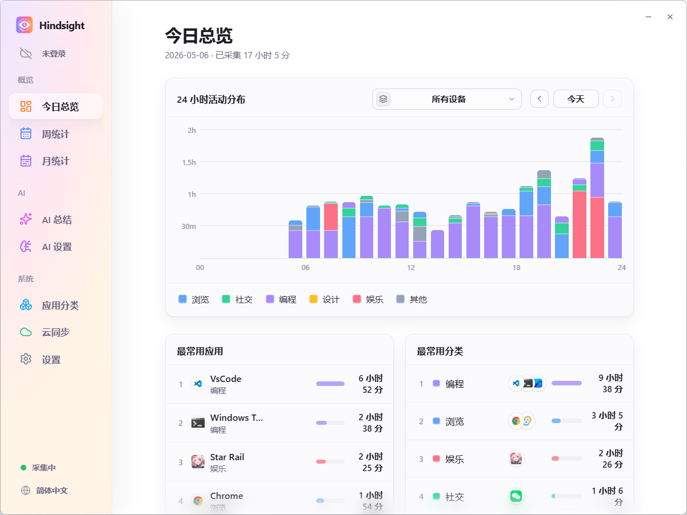
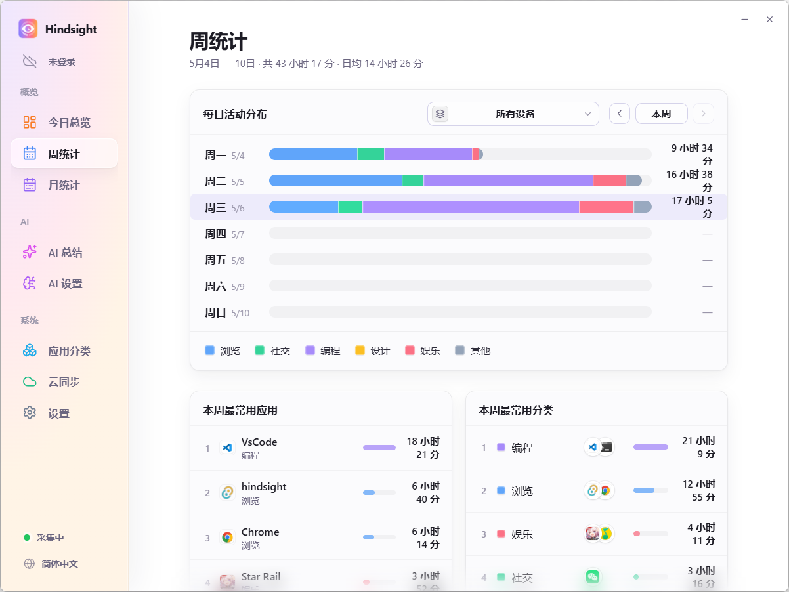
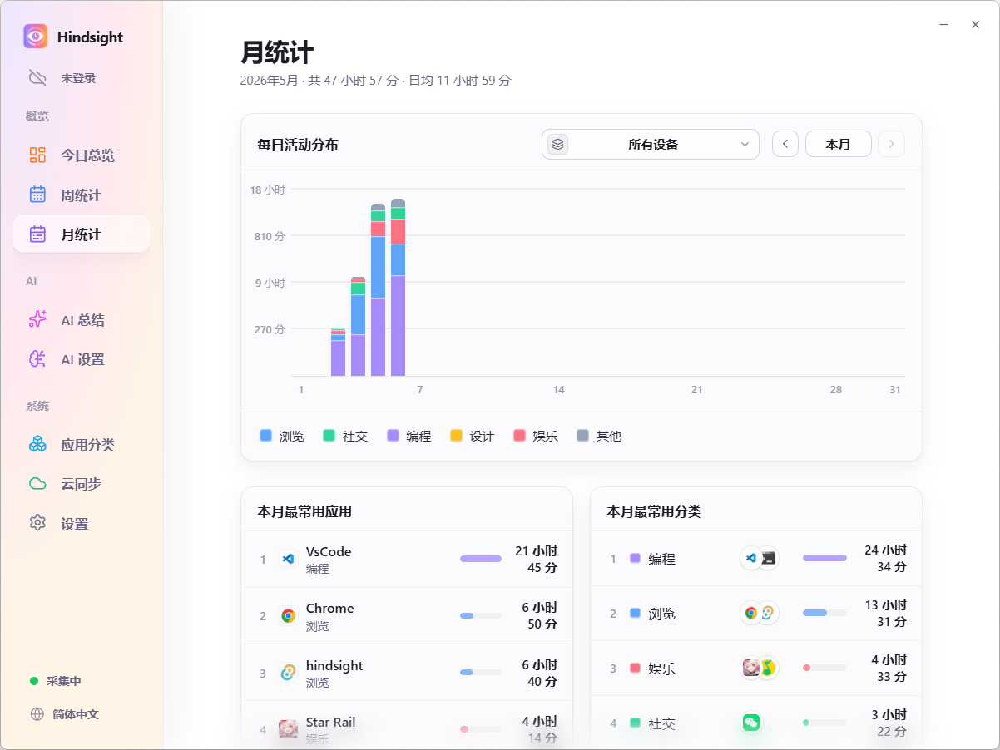
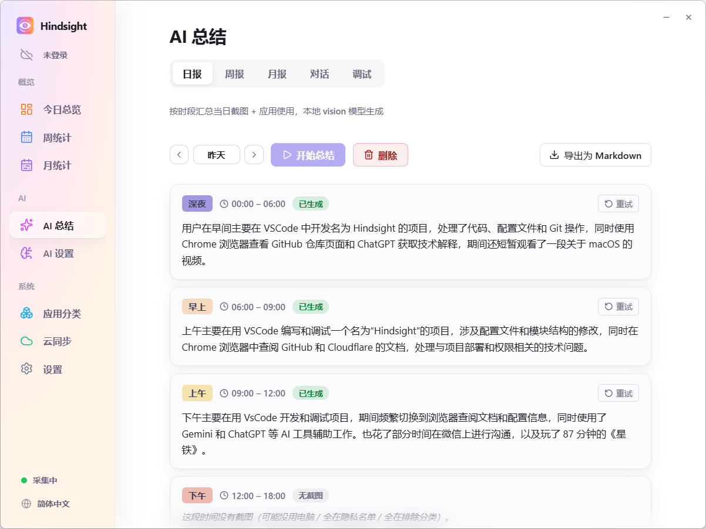
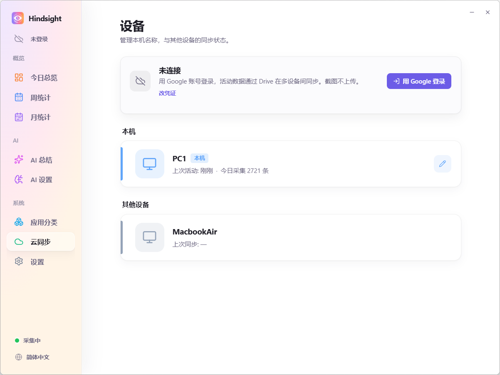
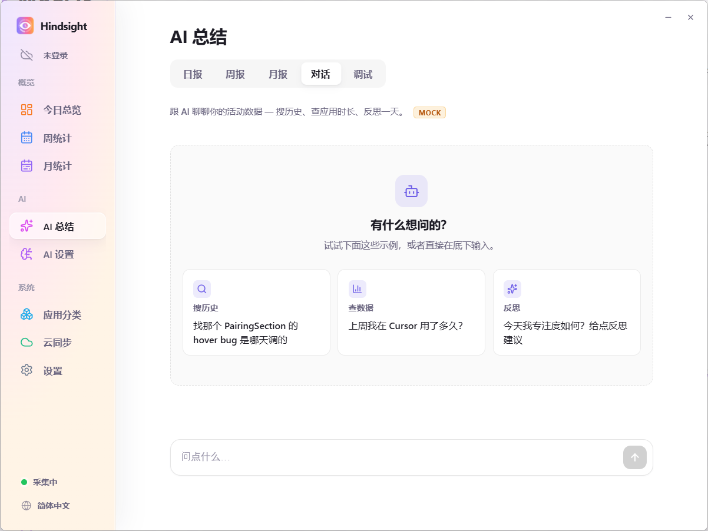

  

<h1 align="center">Hindsight</h1>

  <i>Your computer's diary — it remembers every day for you.</i>

  <a href="README.md">中文</a> · <a href="README.en.md">English</a> · <a href="README.ja.md">日本語</a>

  
  
  
  

---

## Why Hindsight

Have you ever closed the laptop at midnight feeling like you "worked all day" but couldn't say what you actually got done? A while back I went hunting for a tracker to fix exactly that. Tried a bunch — none of them stuck:

- **ActivityWatch** — open-source, privacy-first, technically ticks all the right boxes. Honest take: the UI just doesn't pull me in. I'd install it, look at it once, never open it again.
- **WorkReview-style apps** — couldn't find one with both (a) cross-device visibility and (b) an hourly timeline like iPhone's Screen Time. I really wanted that "what was I doing at 3pm" zoomable view for desktop, and nothing had it the way I wanted.
- **Toggl / RescueTime / paid SaaS** — these feel built for teams and HR-style "billable hours" tracking. The dashboards are dense, the flow is project-tagging-first, and the data lives on someone else's servers. Wrong tool for "personal awareness."

To fix exactly these gaps, I built Hindsight.

## Key Features

- 📊 **See where your time goes** — Background auto-tracking with hourly histograms + app rankings; weekly / monthly aggregation; customizable categories ("Work / Entertainment / Learning")
- 🤖 **AI auto-generated daily report** (new) — Local LLM reads your screenshots and writes a per-segment summary
- ☁️ **Multi-device aggregation** — Optional Google Drive sync of activity data; view across multiple computers (screenshots stay local)
- 🔒 **Local-first, privacy-first** — Data stays on your machine by default; records only during your set work hours; auto-skips screenshots of login / password pages

## Interface Preview

  <video src="https://github.com/user-attachments/assets/68001c5d-f602-40de-8965-b9f46547da39" controls muted autoplay loop playsinline width="800"></video> 
  <i><b>App preview</b> · Hindsight's core interactions in 30 seconds</i>

   
  <i><b>Today Overview</b> · 24-hour stacked histogram × app leaderboard — see where your day went and your work / study rhythm at a glance</i>

<table align="center">
  <tr>
    <td align="center" width="50%">
       
      <i><b>Weekly Stats</b> · 7-day total-time bar comparison with weekly top-app ranking</i>
    </td>
    <td align="center" width="50%">
       
      <i><b>Monthly Stats</b> · Daily bars × monthly ranking — see your long-term work rhythm</i>
    </td>
  </tr>
  <tr>
    <td align="center" width="50%">
       
      <i><b>AI auto-daily-report</b> · Local LLM reads screenshots per time segment and outputs a paragraph-style summary; screenshots stay local</i>
    </td>
    <td align="center" width="50%">
       
      <i><b>Multi-device aggregation</b> · Google Drive syncs activity metadata across machines; screenshots always stay local</i>
    </td>
  </tr>
</table>

   
  <i><b>AI Assistant</b> 🚧 Coming soon · Ask your activity log in natural language: "How many hours did I code last week?" "When am I most easily distracted?"</i>

## Quick Start

Download the installer for your platform from [Releases](https://github.com/Tomotsugu-dev/Hindsight/releases) and install it.

### Windows

Download `hindsight_x.y.z_x64-setup.exe` and double-click to install.

> ⚠️ **First launch will trigger "Windows protected your PC"** — the installer is not yet signed with an EV code-signing certificate, so SmartScreen will block it. Click "More info" → "Run anyway" to continue.

### macOS

Download `hindsight_x.y.z_universal.dmg` (Apple Silicon + Intel universal binary), double-click to mount, then drag Hindsight into the Applications folder. The app is signed with an Apple Developer certificate and notarized, so it opens normally without any Gatekeeper warning.

> All activity data and screenshots are stored locally by default. If you enable Google Drive sync, only activity metadata will be uploaded, **screenshots will not be uploaded**.

## Future Roadmap

- [x] Auto-identify and categorize frequently-used apps, with user adjustment capability
- [x] Support for auto-updates
- [x] AI analysis features (analyze daily, weekly, and monthly overviews, identify work content more accurately based on screenshot content)
- [ ] Generate work reports (daily, weekly, monthly)
- [ ] Add screenshot encryption to protect privacy
- [ ] Support for more platforms (Linux, mobile)

## Tech Stack

| Category | Technology |
|---|---|
| Desktop framework | [Tauri 2](https://tauri.app/) |
| Frontend | React 19 · TypeScript · Vite |
| Backend | Rust · Tokio · SQLite · reqwest |
| AI inference | [llama.cpp](https://github.com/ggml-org/llama.cpp) · Qwen2.5-VL / Qwen3-VL · OpenAI-compatible API |
| Sync | Google Drive API |

## License

  This project is open source under the <a href="LICENSE"><b>MIT License</b></a>. Feel free to use, modify, and distribute. 
  © 2026 Hindsight contributors

