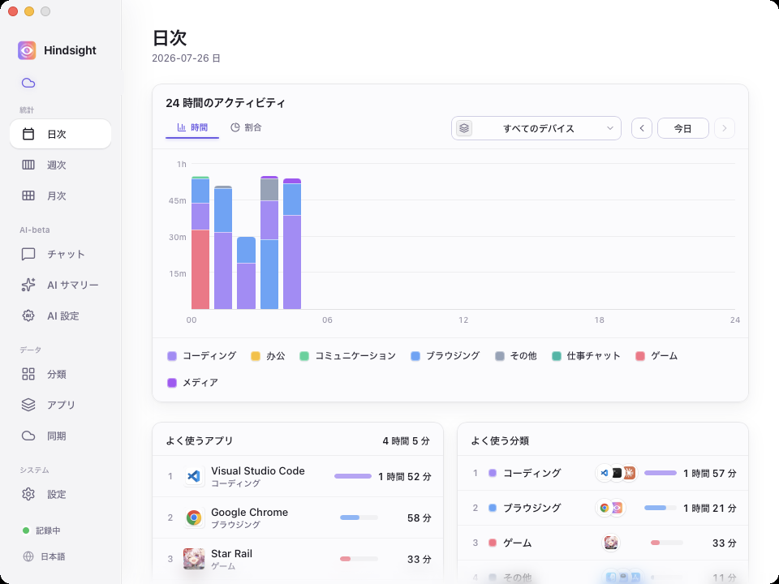
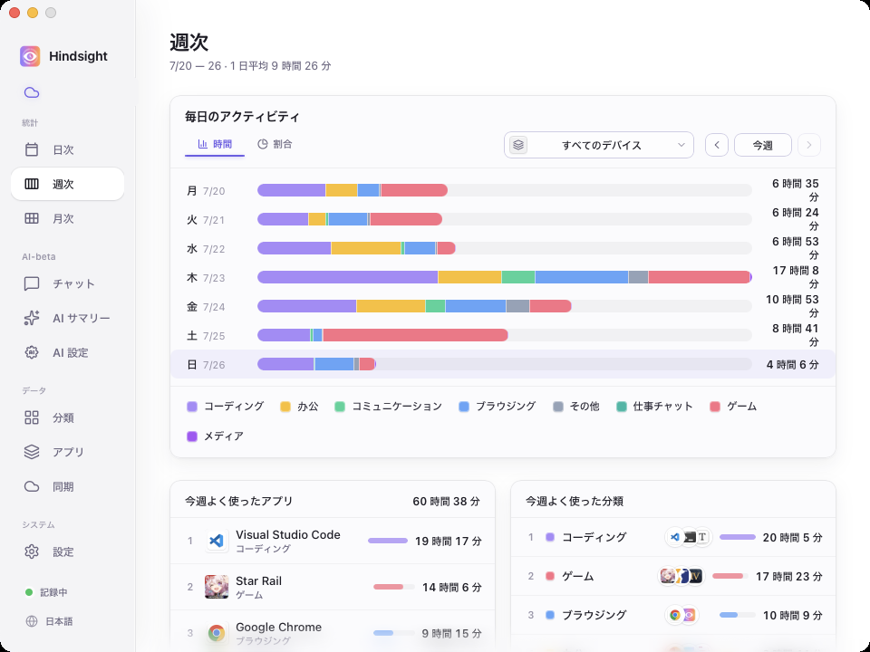
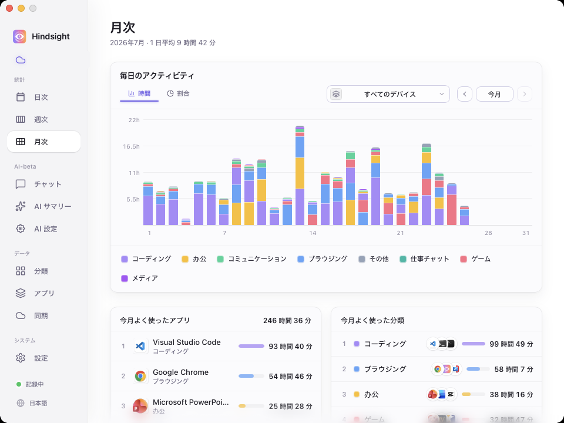
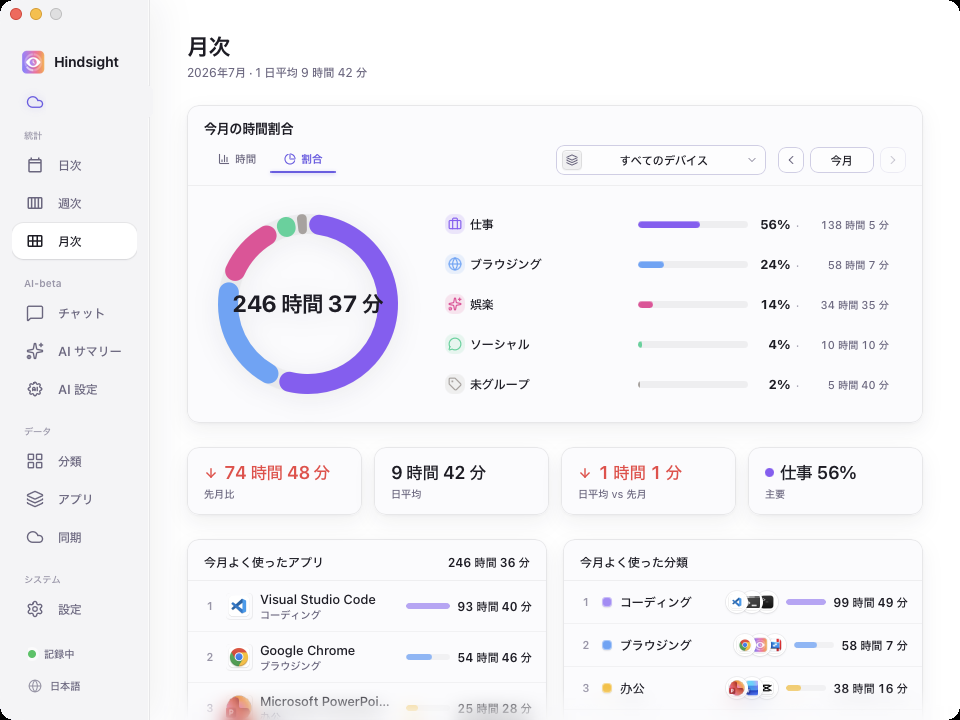
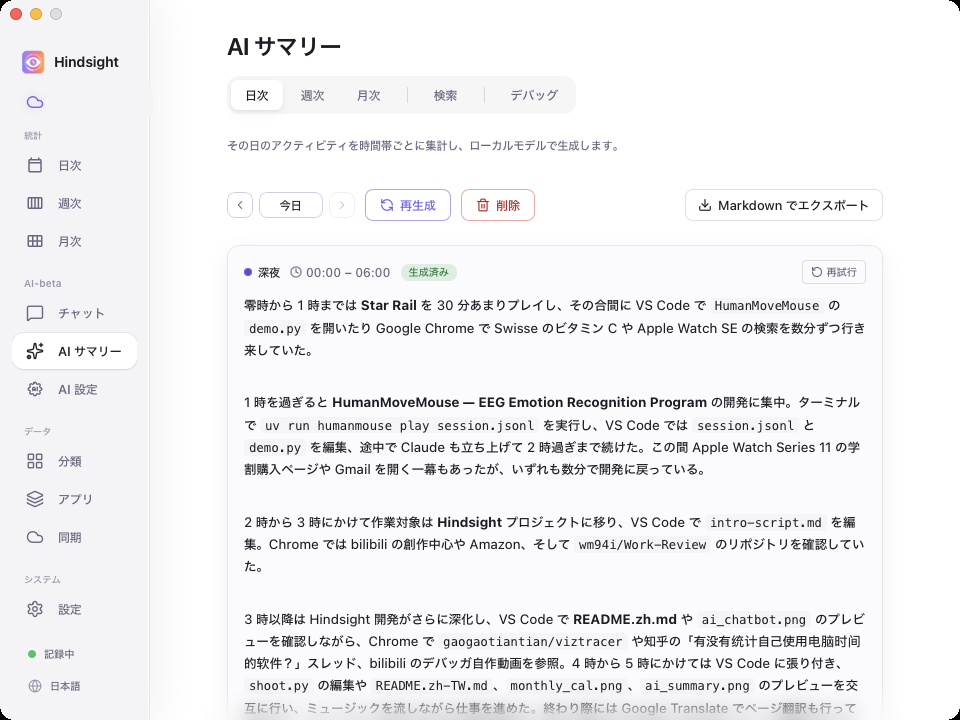
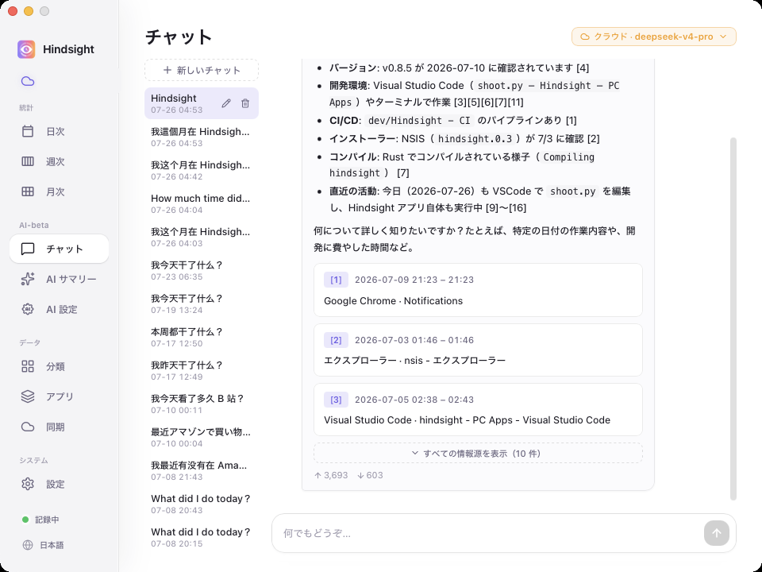
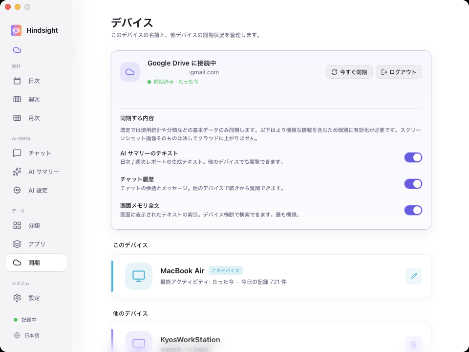

  

<h1 align="center">Hindsight</h1>

  <strong>ローカルファーストの PC アクティビティログ & AI 振り返りツール</strong> 
  アプリとウィンドウの活動を自動記録し、日・週・月で時間の行き先を再現。手動計測もプロジェクトタグの管理も不要。

  <a href="README.zh.md">简体中文</a> · <a href="README.zh-TW.md">繁體中文</a> · <a href="../README.md">English</a> · <a href="README.ja.md">日本語</a> · <a href="README.pt.md">Português</a>

  
  
  
  

  
  

  <a href="https://github.com/Tomotsugu-dev/Hindsight/releases"><b>最新版をダウンロード</b></a> ·
  <a href="#インターフェースプレビュー">インターフェースプレビュー</a> ·
  <a href="#主な機能">主な機能</a> ·
  <a href="#クイックスタート">クイックスタート</a>

---

## インターフェースプレビュー

  <video src="https://github.com/user-attachments/assets/d5101400-1b86-4b8a-b218-c3d8de9b6261" controls muted autoplay loop playsinline width="800"></video>

  <b>アプリプレビュー</b> · Hindsight の主要な操作を 1 分で

   
  <b>日次統計</b> · 24 時間の時間帯別積み上げグラフ × アプリ / カテゴリのダブルランキング。今日の時間の行き先が一目で

   
  <b>アプリ詳細</b> · アプリをクリックすると、その中で何をしていたかまで見える

   
  <b>週次統計</b> · 一週間の作業状況をひと目で

   
  <b>月次統計</b> · 日別の活動時間とアプリ / カテゴリランキングで、今月の時間の使い道を把握

   
  <b>今月の時間構成</b> · カテゴリ別の時間と割合に加え、合計・日平均・先月比をまとめて表示

   
  <b>AI 自動日報</b> · ローカル / クラウドモデルが時間帯ごとに当日の活動をまとめ、日報として出力

   
  <b>AI チャット</b> · 「今月 XX にどれくらい時間を使った？」と直接聞ける

   
  <b>マルチデバイス同期</b> · 複数台のパソコンを使う人に

## 主な機能

- 📊 **時間の行き先が一目で** — バックグラウンドで自動記録、時間帯別グラフ + アプリランキング。日 / 週 / 月で集計、アプリをクリックすればウィンドウタイトル単位の詳細まで。分類は自由にカスタマイズ可（「仕事 / 娯楽 / 学習」）
- 🤖 **AI 自動日報** — ローカルモデルが時間帯ごとに当日の活動を日報に。「自動まとめ」を有効にすると、前日の日報と先週の週報が自動で補完されます
- 💬 **AI チャット** — 「今日何をした？」「今月 XX プロジェクトにどれくらい使った？」と直接質問。自分の記録に基づいて回答します
- 🔍 **画面メモリ検索** — 画面に表示された文字を後から検索し、当時のスクリーンショットと時刻へ移動（スクリーンショットと文字認識はデフォルトでオフ、必要に応じて有効化）
- ☁️ **マルチデバイス集約** — Google Drive で活動データを同期（任意）、複数のパソコンをまとめて閲覧（スクリーンショットは常にローカル）
- 🔒 **ローカル・プライバシー優先** — データはデフォルトで本機のみに保存

## なぜ Hindsight

深夜にノートパソコンを閉じた瞬間、「今日も一日働いた気がする」のに、何をやり遂げたのか具体的に言えない——そんな経験はありませんか？少し前、この問題を解決しようとトラッキングツールを探し回りましたが、どれも続きませんでした：

- **[ActivityWatch](https://github.com/ActivityWatch/activitywatch)** — オープンソースでプライバシー重視、機能リスト上はすべて揃っています。正直な感想：UI に惹かれず、インストールして一度開いてそれきり。
- **[WorkReview](https://github.com/wm94i/Work-Review)** — (a) 複数デバイス間での集約と (b) iPhone のスクリーンタイムのような時間単位のタイムライン、両方を満たすものが見つかりませんでした。「午後 3 時に何をしていたか」が一目で分かるズーム可能なビュー、デスクトップでは納得できる形で実装されていません。
- **[Toggl](https://toggl.com) / [RescueTime](https://www.rescuetime.com) / 各種有料 SaaS** — どれもチームや HR 向けの「課金工数」管理のために作られているように感じます。ダッシュボードは情報過多、フローはプロジェクトのタグ付けが前提、データは他社のクラウドに置かれます。「自分自身を振り返る」用途には向きません。

これらの課題を解決するために、Hindsight が生まれました。

## クイックスタート

[Releases](https://github.com/Tomotsugu-dev/Hindsight/releases) からお使いのプラットフォーム用のインストーラーをダウンロードしてインストールしてください。

### Windows

`hindsight_x.y.z_x64-setup.exe` をダウンロードしてダブルクリックでインストールできます。

> ⚠️ **初回実行時に「WindowsによってPCが保護されました」と表示されます** — インストーラーはまだ EV コード署名証明書を取得していないため、SmartScreen にブロックされます。「詳細情報」→「実行」をクリックしてインストールを続行してください。

### macOS

`hindsight_x.y.z_universal.dmg`（Apple Silicon + Intel ユニバーサルバイナリ）をダウンロードし、ダブルクリックでマウントしてから Hindsight を「アプリケーション」フォルダにドラッグします。Apple Developer 証明書による署名と公証済みのため、Gatekeeper の警告なしでそのまま開けます。

> すべてのアクティビティデータとスクリーンショットはデフォルトでローカルに保存されます。Google Drive の同期を有効にした場合、アクティビティメタデータのみがアップロードされ、**スクリーンショットはアップロードされません**。

## ライセンス

  本プロジェクトは<a href="../LICENSE"><b>MITライセンス</b></a>の下でオープンソースとして公開されています。自由に使用、改変、配布できます。 
  © 2026 Hindsight contributors

