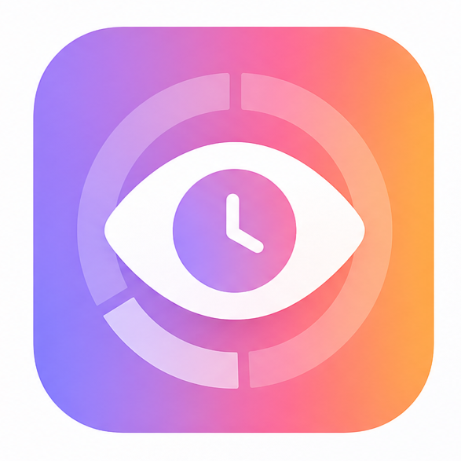
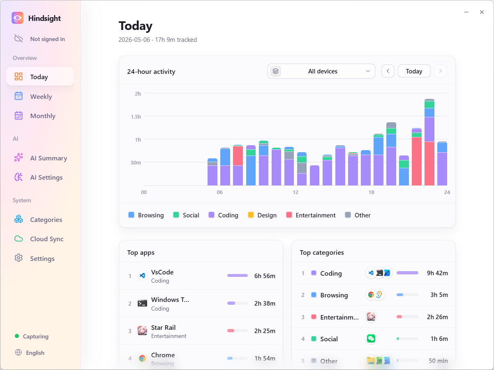
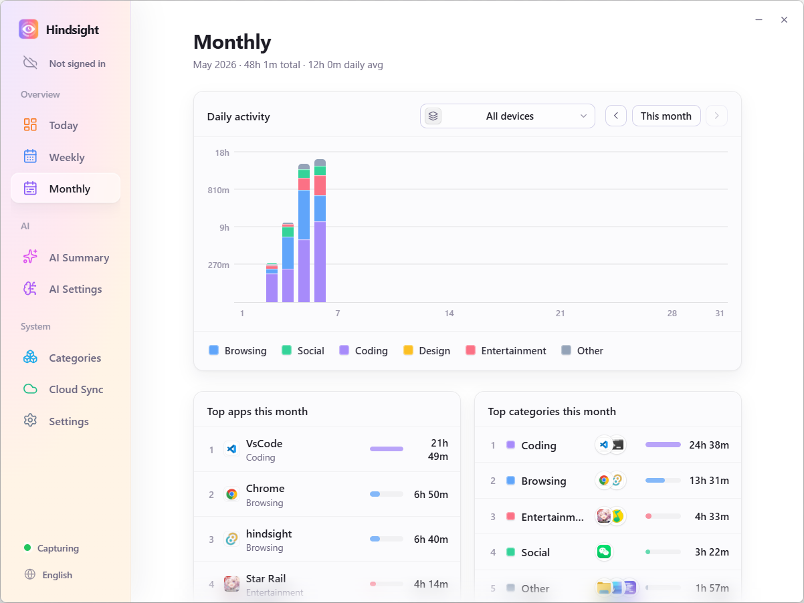
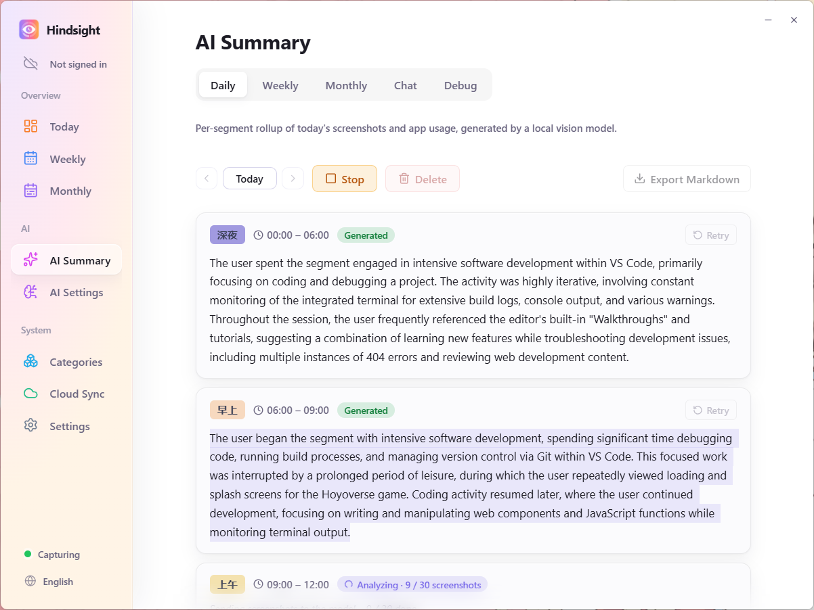

  

<h1 align="center">Hindsight</h1>

  <i>O diário do seu computador — ele lembra cada dia por você.</i>

  <a href="README.zh.md">简体中文</a> · <a href="../README.md">English</a> · <a href="README.ja.md">日本語</a> · <a href="README.pt.md">Português</a>

  
  
  
  

---

## Por que o Hindsight

Você já fechou o notebook à meia-noite com a sensação de ter "trabalhado o dia inteiro", mas sem conseguir dizer o que de fato terminou? Há um tempo, saí à procura de um rastreador justamente para resolver isso. Testei vários — nenhum me conquistou:

- **ActivityWatch** — código aberto, foco em privacidade, no papel marca todos os pontos certos. Sendo sincero: a interface simplesmente não me prende. Eu instalava, olhava uma vez e nunca mais abria.
- **Apps no estilo WorkReview** — não achei nenhum que tivesse, ao mesmo tempo, (a) visão entre dispositivos e (b) uma linha do tempo por hora, como o Tempo de Uso do iPhone. Eu queria muito aquela visão ampliável de "o que eu estava fazendo às 15h" no desktop, e nada fazia isso do jeito que eu queria.
- **Toggl / RescueTime / SaaS pagos** — parecem feitos para equipes e para o controle de "horas faturáveis" no estilo RH. Os painéis são densos, o fluxo gira em torno de etiquetar projetos, e os dados ficam no servidor dos outros. Ferramenta errada para "autoconsciência pessoal".

Foi para preencher exatamente essas lacunas que criei o Hindsight.

## Prévia da interface

  <video src="https://github.com/user-attachments/assets/fe05771d-718a-418b-80a1-12fd76a826ab" controls muted autoplay loop playsinline width="800"></video>

  <i><b>Prévia do app</b> · As interações principais do Hindsight em 1 minuto</i>

   
  <i><b>Visão de Hoje</b> · Histograma empilhado de 24 horas × ranking de apps — veja para onde foi o seu dia e o seu ritmo de trabalho/estudo num relance</i>

   
  <i><b>Estatísticas mensais</b> · Barras diárias × ranking mensal — acompanhe seu ritmo de trabalho no longo prazo</i>

   
  <i><b>Relatório diário automático por IA</b> · Um LLM local lê as capturas de tela de cada período e gera um resumo em texto corrido; as capturas permanecem no seu computador</i>

## Principais recursos

- 📊 **Veja para onde vai o seu tempo** — Rastreamento automático em segundo plano, com histogramas por hora + rankings de apps; agregação semanal/mensal; categorias personalizáveis ("Trabalho / Entretenimento / Estudo")
- 🤖 **Relatório diário gerado por IA** (novo) — Um LLM local lê suas capturas de tela e escreve um resumo por período
- ☁️ **Agregação entre dispositivos** — Sincronização opcional dos dados de atividade via Google Drive; veja tudo em vários computadores (as capturas permanecem locais)
- 🔒 **Local em primeiro lugar, privacidade em primeiro lugar** — Por padrão, os dados ficam na sua máquina; grava apenas durante o horário de trabalho que você definir; ignora automaticamente capturas de páginas de login/senha

## Começo rápido

Baixe o instalador da sua plataforma em [Releases](https://github.com/Tomotsugu-dev/Hindsight/releases) e instale.

### Windows

Baixe `hindsight_x.y.z_x64-setup.exe` e clique duas vezes para instalar.

> ⚠️ **A primeira execução vai disparar o aviso "O Windows protegeu o seu PC"** — o instalador ainda não está assinado com um certificado de assinatura de código EV, então o SmartScreen vai bloqueá-lo. Clique em "Mais informações" → "Executar assim mesmo" para continuar.

### macOS

Baixe `hindsight_x.y.z_universal.dmg` (binário universal para Apple Silicon + Intel), clique duas vezes para montar e arraste o Hindsight para a pasta Aplicativos. O app é assinado com um certificado de desenvolvedor Apple e passou pela autenticação da Apple (notarization), então abre normalmente, sem nenhum aviso do Gatekeeper.

> Por padrão, todos os dados de atividade e capturas de tela ficam armazenados localmente. Se você ativar a sincronização com o Google Drive, apenas os metadados de atividade serão enviados — **as capturas de tela não são enviadas**.

## Tecnologias

| Categoria | Tecnologia |
|---|---|
| Framework desktop | [Tauri 2](https://tauri.app/) |
| Frontend | React 19 · TypeScript · Vite |
| Backend | Rust · Tokio · SQLite · reqwest |
| Inferência de IA | [llama.cpp](https://github.com/ggml-org/llama.cpp) · Qwen2.5-VL / Qwen3-VL · API compatível com OpenAI |
| Sincronização | Google Drive API |

## Licença

  Este projeto é de código aberto sob a <a href="../LICENSE"><b>Licença MIT</b></a>. Sinta-se à vontade para usar, modificar e distribuir. 
  © 2026 colaboradores do Hindsight

