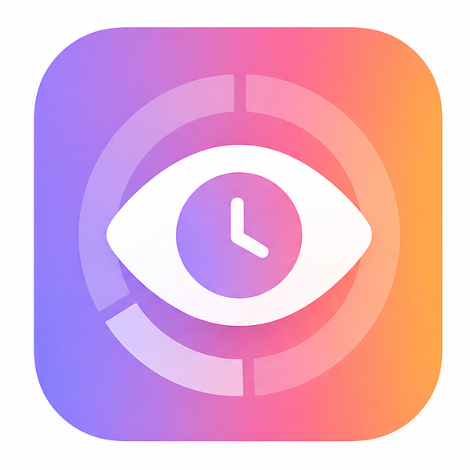
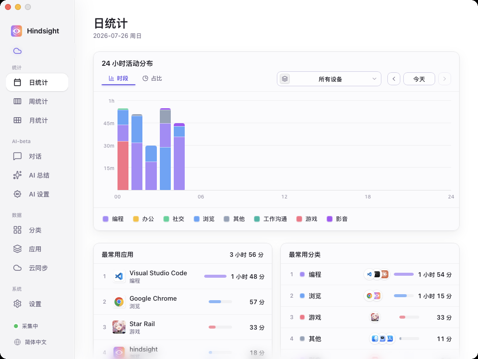
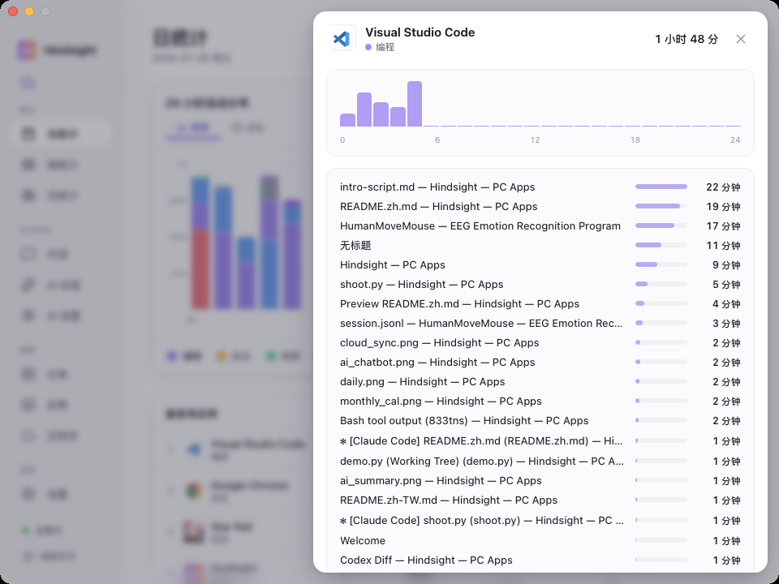
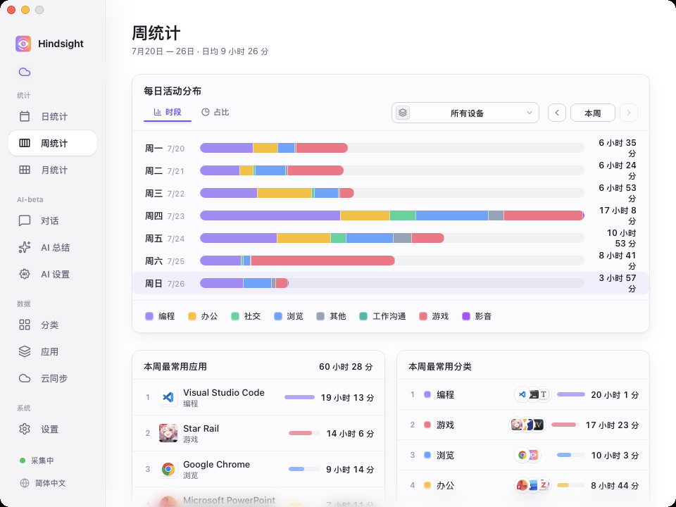
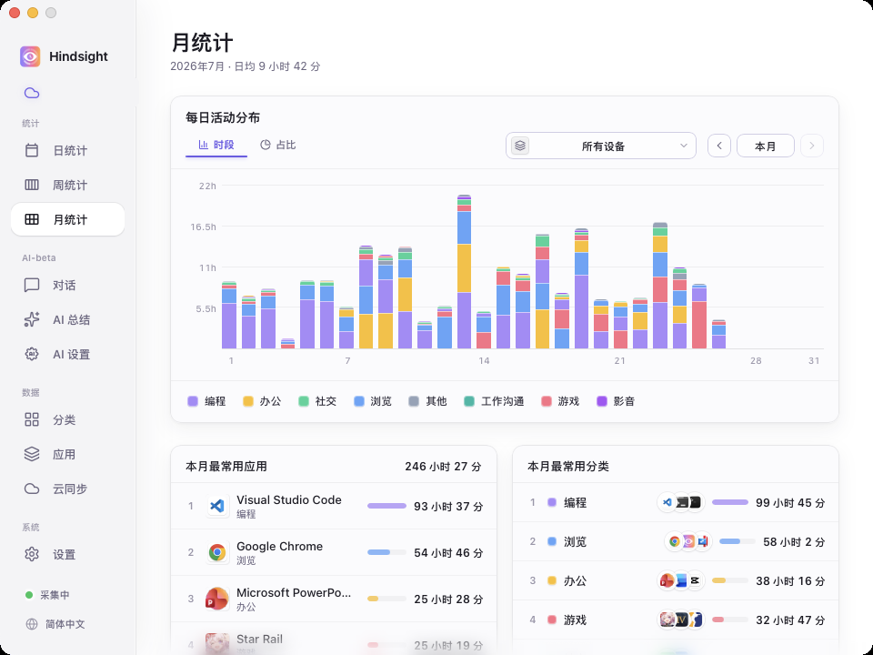
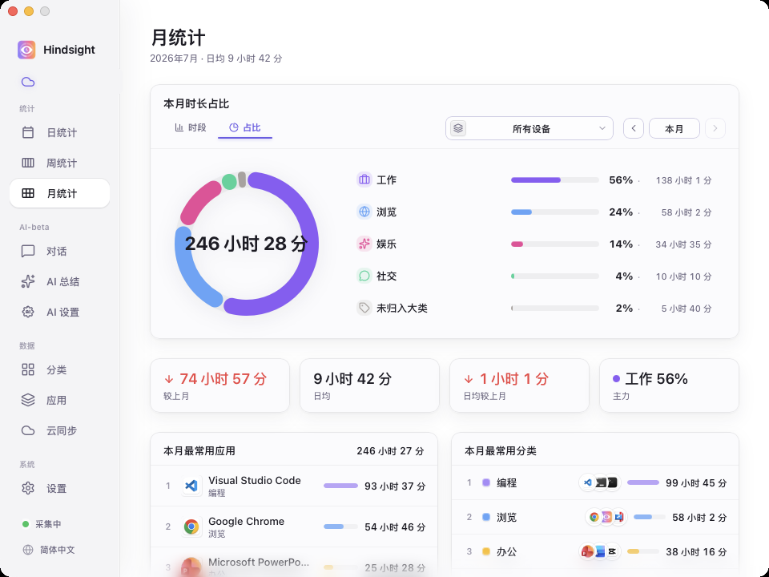
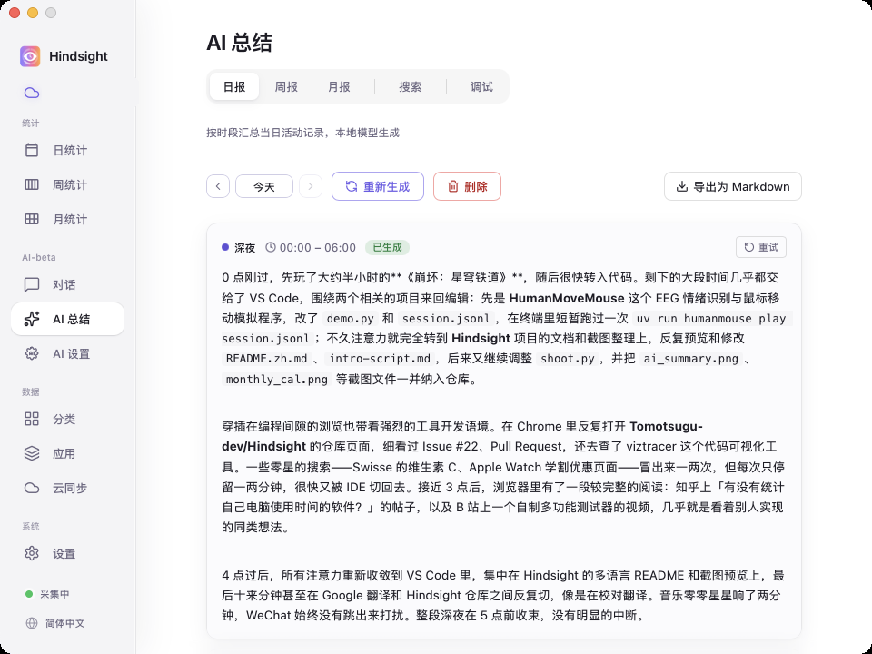
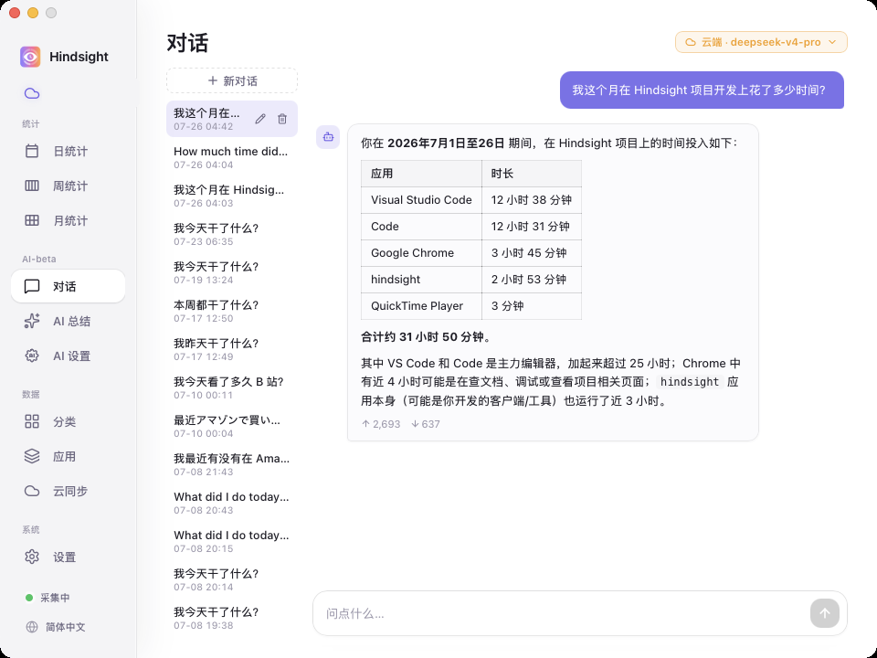
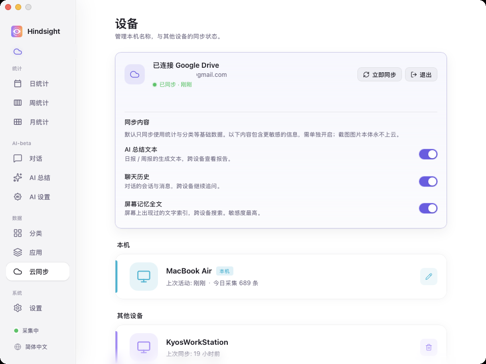

  

<h1 align="center">Hindsight</h1>

  <strong>Um registro local de atividades do computador com revisão por IA</strong> 
  Registra automaticamente apps e janelas e mostra para onde foi seu tempo por dia, semana e mês — sem cronômetro manual nem etiquetas de projeto para manter.

  <a href="README.zh.md">简体中文</a> · <a href="README.zh-TW.md">繁體中文</a> · <a href="../README.md">English</a> · <a href="README.ja.md">日本語</a> · <a href="README.pt.md">Português</a>

  
  
  
  

  
  

  <a href="https://github.com/Tomotsugu-dev/Hindsight/releases"><b>Baixar a versão mais recente</b></a> ·
  <a href="#prévia-da-interface">Prévia da interface</a> ·
  <a href="#principais-recursos">Principais recursos</a> ·
  <a href="#começo-rápido">Começo rápido</a>

---

## Prévia da interface

  <video src="https://github.com/user-attachments/assets/fe05771d-718a-418b-80a1-12fd76a826ab" controls muted autoplay loop playsinline width="800"></video>

  <b>Prévia do app</b> · As interações principais do Hindsight em 1 minuto

   
  <b>Estatísticas diárias</b> · Gráfico empilhado de 24 horas × rankings de apps / categorias — veja para onde foi o seu dia num relance

   
  <b>Detalhe do app</b> · Clique em qualquer app para ver o que você estava fazendo dentro dele

   
  <b>Estatísticas semanais</b> · Sua semana inteira num relance

   
  <b>Estatísticas mensais</b> · Barras diárias com rankings de apps / categorias — veja para onde foi o tempo do mês

   
  <b>Estrutura do mês</b> · Tempo e proporção por categoria, com total, média diária e variação em relação ao mês anterior

   
  <b>Relatório diário por IA</b> · Um modelo local ou na nuvem resume as atividades do dia por período e escreve o diário

   
  <b>Chat com IA</b> · Pergunte direto, por exemplo: "quanto tempo passei em XX este mês?"

   
  <b>Sincronização multi-dispositivo</b> · Para quem usa mais de um computador

## Principais recursos

- 📊 **Veja para onde vai o seu tempo** — Registro automático em segundo plano, com gráficos por período + ranking de apps; agregação diária / semanal / mensal, clique em qualquer app para ver detalhes por título de janela; categorias personalizáveis ("Trabalho / Entretenimento / Estudo")
- 🤖 **Relatório diário por IA** — Um modelo local escreve o diário do dia por período; com o Resumo automático ativado, o diário de ontem e o semanal da semana passada são preenchidos sozinhos
- 💬 **Chat com IA** — Pergunte "o que eu fiz hoje?" ou "quanto tempo passei no projeto X este mês?" — respondido com base nos seus próprios registros
- 🔍 **Busca na memória de tela** — Encontre qualquer texto que já apareceu na sua tela e vá direto à captura e ao momento (capturas e OCR vêm desativados por padrão, ative se quiser)
- ☁️ **Agregação multi-dispositivo** — Sincronização opcional dos dados de atividade via Google Drive; veja todos os seus computadores num lugar só (as capturas nunca saem do aparelho)
- 🔒 **Local e privado por padrão** — Os dados ficam apenas na sua máquina

## Por que o Hindsight

Você já fechou o notebook à meia-noite com a sensação de ter "trabalhado o dia inteiro", mas sem conseguir dizer o que de fato terminou? Há um tempo, saí à procura de um rastreador justamente para resolver isso. Testei vários — nenhum me conquistou:

- **[ActivityWatch](https://github.com/ActivityWatch/activitywatch)** — código aberto, foco em privacidade, no papel marca todos os pontos certos. Sendo sincero: a interface simplesmente não me prende. Eu instalava, olhava uma vez e nunca mais abria.
- **[WorkReview](https://github.com/wm94i/Work-Review)** — não achei nenhum que tivesse, ao mesmo tempo, (a) visão entre dispositivos e (b) uma linha do tempo por hora, como o Tempo de Uso do iPhone. Eu queria muito aquela visão ampliável de "o que eu estava fazendo às 15h" no desktop, e nada fazia isso do jeito que eu queria.
- **[Toggl](https://toggl.com) / [RescueTime](https://www.rescuetime.com) / SaaS pagos** — parecem feitos para equipes e para o controle de "horas faturáveis" no estilo RH. Os painéis são densos, o fluxo gira em torno de etiquetar projetos, e os dados ficam no servidor dos outros. Ferramenta errada para "autoconsciência pessoal".

Foi para preencher exatamente essas lacunas que criei o Hindsight.

## Começo rápido

Baixe o instalador da sua plataforma em [Releases](https://github.com/Tomotsugu-dev/Hindsight/releases) e instale.

### Windows

Baixe `hindsight_x.y.z_x64-setup.exe` e clique duas vezes para instalar.

> ⚠️ **A primeira execução vai disparar o aviso "O Windows protegeu o seu PC"** — o instalador ainda não está assinado com um certificado de assinatura de código EV, então o SmartScreen vai bloqueá-lo. Clique em "Mais informações" → "Executar assim mesmo" para continuar.

### macOS

Baixe `hindsight_x.y.z_universal.dmg` (binário universal para Apple Silicon + Intel), clique duas vezes para montar e arraste o Hindsight para a pasta Aplicativos. O app é assinado com um certificado de desenvolvedor Apple e passou pela autenticação da Apple (notarization), então abre normalmente, sem nenhum aviso do Gatekeeper.

> Por padrão, todos os dados de atividade e capturas de tela ficam armazenados localmente. Se você ativar a sincronização com o Google Drive, apenas os metadados de atividade serão enviados — **as capturas de tela não são enviadas**.

## Licença

  Este projeto é de código aberto sob a <a href="../LICENSE"><b>Licença MIT</b></a>. Sinta-se à vontade para usar, modificar e distribuir. 
  © 2026 colaboradores do Hindsight

