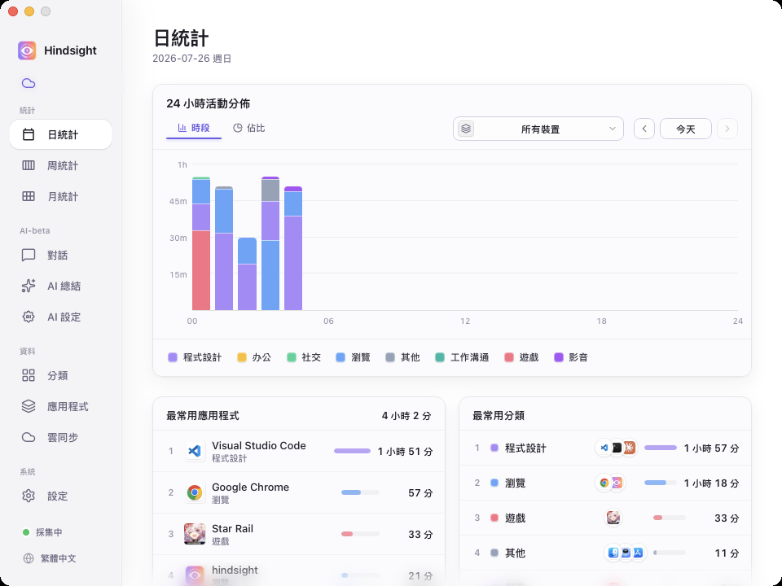
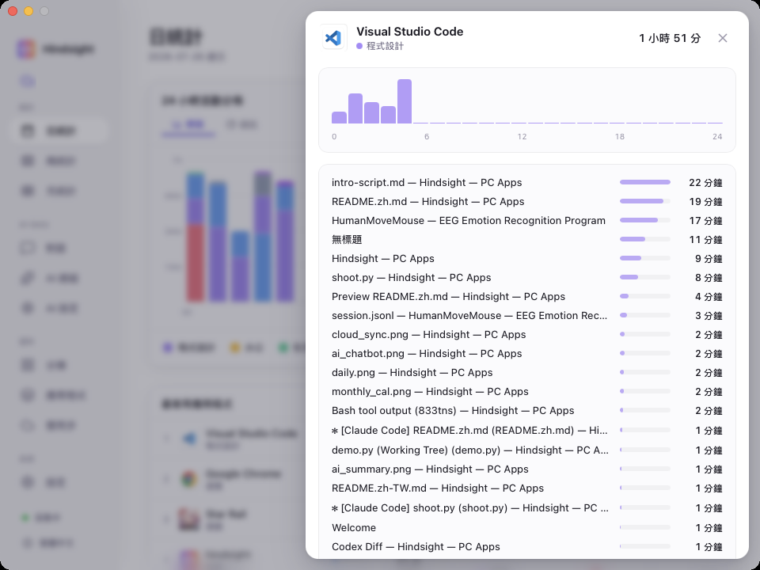
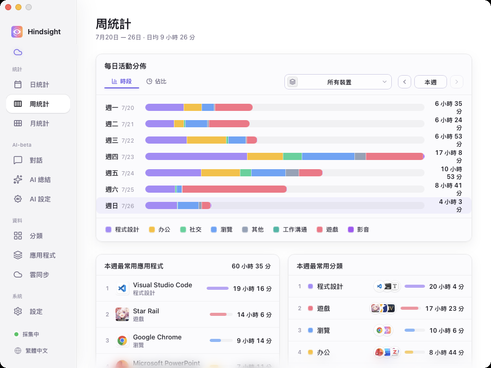
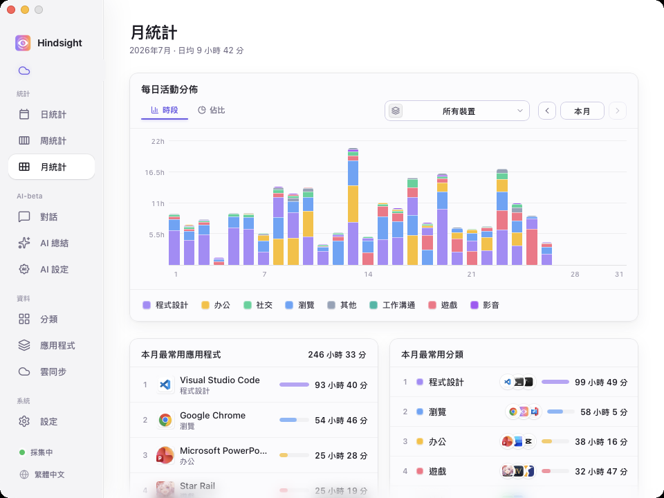
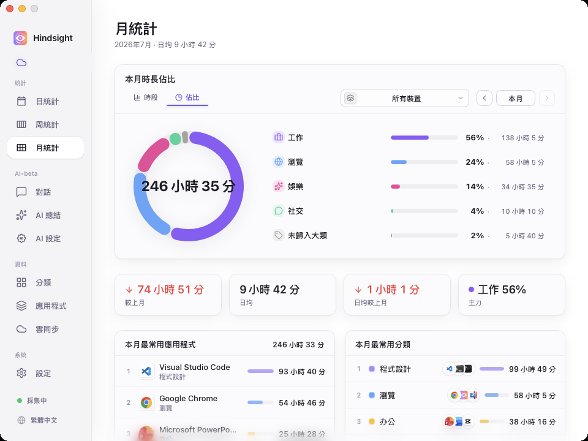
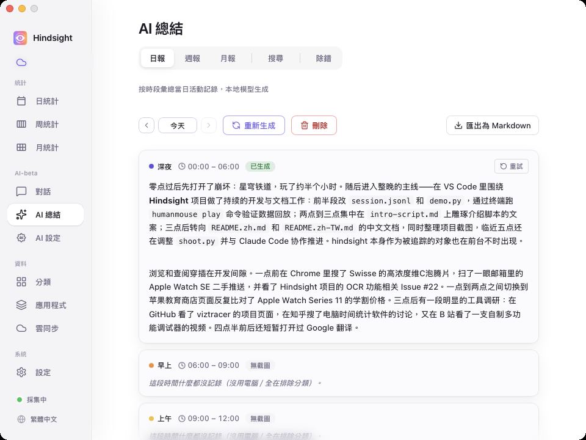
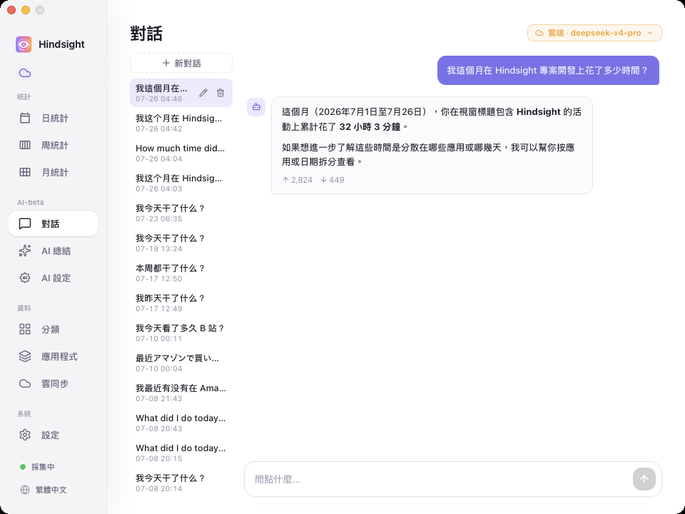
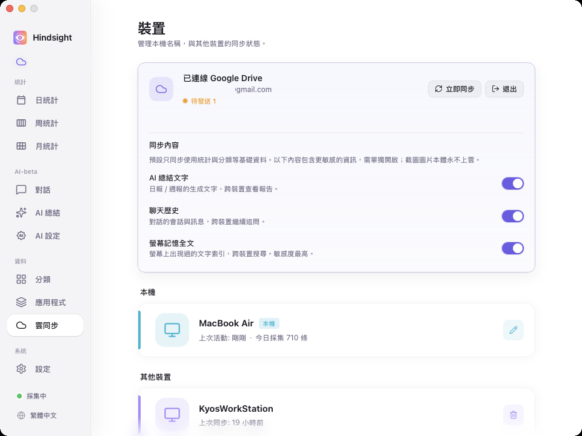

  

<h1 align="center">Hindsight</h1>

  <strong>本機優先的電腦活動日誌與 AI 復盤工具</strong> 
  自動記錄應用與視窗活動，按日、週、月還原時間去向；無需手動計時，也無需維護專案標籤。

  <a href="README.zh.md">简体中文</a> · <a href="README.zh-TW.md">繁體中文</a> · <a href="../README.md">English</a> · <a href="README.ja.md">日本語</a> · <a href="README.pt.md">Português</a>

  
  
  
  

  
  

  <a href="https://github.com/Tomotsugu-dev/Hindsight/releases"><b>下載最新版</b></a> ·
  <a href="#介面預覽">介面預覽</a> ·
  <a href="#主要功能">主要功能</a> ·
  <a href="#快速開始">快速開始</a>

---

## 介面預覽

  <video src="https://github.com/user-attachments/assets/71c610f9-d0ac-4cee-9511-82842c8e6580" controls muted autoplay loop playsinline width="800"></video>

  <b>軟體預覽</b> · 1 分鐘看清 Hindsight 的核心互動

   
  <b>日統計</b> · 24 小時分時段堆疊圖 × 應用 / 分類雙排行，一眼看清今天的時間去向

   
  <b>應用明細</b> · 點開任意應用，看到都在應用中做什麼

   
  <b>週統計</b> · 一週七天的工作情況

   
  <b>月統計</b> · 按天展示各類活動時長，結合應用 / 分類排行，看清本月時間主要花在哪裡

   
  <b>本月時間結構</b> · 展示各類活動的時長與佔比，並彙總總時長、日均時長及較上月變化

   
  <b>AI 自動寫日報</b> · 本機 / 雲端模型按時段彙總當天的活動，寫成日報

   
  <b>AI 對話</b> · 直接問例如「這個月我在 XX 上花了多久」

   
  <b>多裝置同步</b> · 適合持有多台裝置的使用者

## 主要功能

- 📊 **看清時間花在哪** — 背景自動記錄，分時段長條圖 + 應用排行；按日 / 週 / 月彙總，點開任意應用看標題級明細；可自訂分類（「工作 / 娛樂 / 學習」）
- 🤖 **AI 自動寫日報** — 本機模型按時段把當天的活動寫成日報；開啟「自動總結」後，前一天的日報和上一週的週報會自動補齊
- 💬 **AI 對話** — 直接問「我今天做了什麼」「這個月在 XX 專案上花了多久」，基於你自己的記錄回答
- 🔍 **螢幕記憶搜尋** — 螢幕上出現過的文字都能搜回來，定位到當時的截圖與時刻（截圖與文字辨識預設關閉，按需開啟）
- ☁️ **多裝置彙總** — 可選 Google Drive 同步活動資料，多台電腦一處檢視（截圖始終留在本機）
- 🔒 **本機·隱私優先** — 資料預設僅存本機

## 為什麼是 Hindsight

你是不是也常常凌晨闔上電腦，覺得自己「忙了一整天」，卻說不上今天到底做成了什麼？前陣子我想找個時間追蹤工具來解決這個問題，市面上挑了一圈都沒用下去：

- **[ActivityWatch](https://github.com/ActivityWatch/activitywatch)** — 開源、隱私優先，功能上挑不出毛病。但老實說，它的介面沒什麼吸引力，裝完打開看過一次，之後就再也沒點開過。
- **[WorkReview](https://github.com/wm94i/Work-Review)** — 我想要兩件事同時滿足：一是能跨裝置彙總，二是像 iPhone「螢幕使用時間」那樣按小時縮放的時間軸，讓我直接看到「下午 3 點我在做什麼」。桌面端沒有一款做到讓我滿意。
- **[Toggl](https://toggl.com) / [RescueTime](https://www.rescuetime.com) / 各種付費 SaaS** — 這些本質上是給團隊和 HR 算「計費工時」用的：儀表板資訊密集，流程繞著專案貼標籤轉，資料還要傳到對方的雲端。我要的是「自己跟自己覆盤」，方向完全對不上。

為了解決以上這些問題，Hindsight 應運而生。

## 快速開始

從 [Releases](https://github.com/Tomotsugu-dev/Hindsight/releases) 下載對應平台的安裝檔並安裝。

### Windows

下載 `hindsight_x.y.z_x64-setup.exe`，按兩下安裝即可。

> ⚠️ **首次執行會跳出「Windows 已保護你的電腦」** — 安裝檔尚未購買 EV 程式碼簽章憑證，會被 SmartScreen 攔下。點選「其他資訊」→「仍要執行」即可繼續安裝。

### MacOS

下載 `hindsight_x.y.z_universal.dmg`（Apple Silicon + Intel 通用二進位檔），按兩下掛載後將 Hindsight 拖入「應用程式」即可正常開啟——應用程式已接入 Apple 開發者憑證簽署 + 公證，不會再觸發 Gatekeeper 警告。

> 所有活動資料 / 截圖預設僅存本機。如果開啟 Google Drive 同步，只會上傳活動中繼資料，**不會上傳截圖**。

## License

  本專案基於 <a href="../LICENSE"><b>MIT License</b></a> 開源，歡迎自由使用、修改與散布。 
  © 2026 Hindsight contributors

