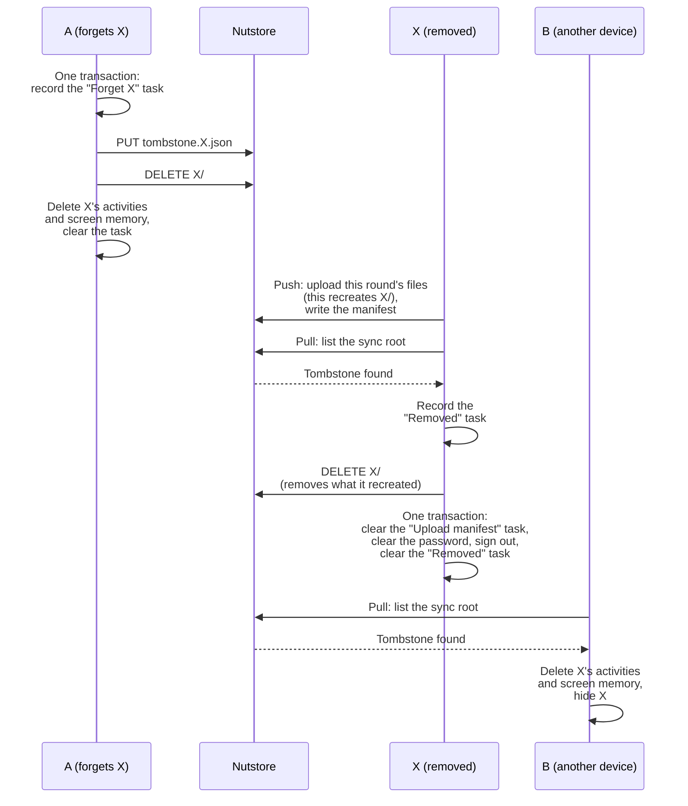
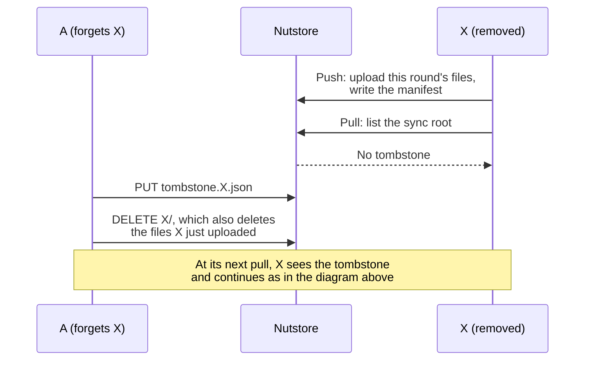
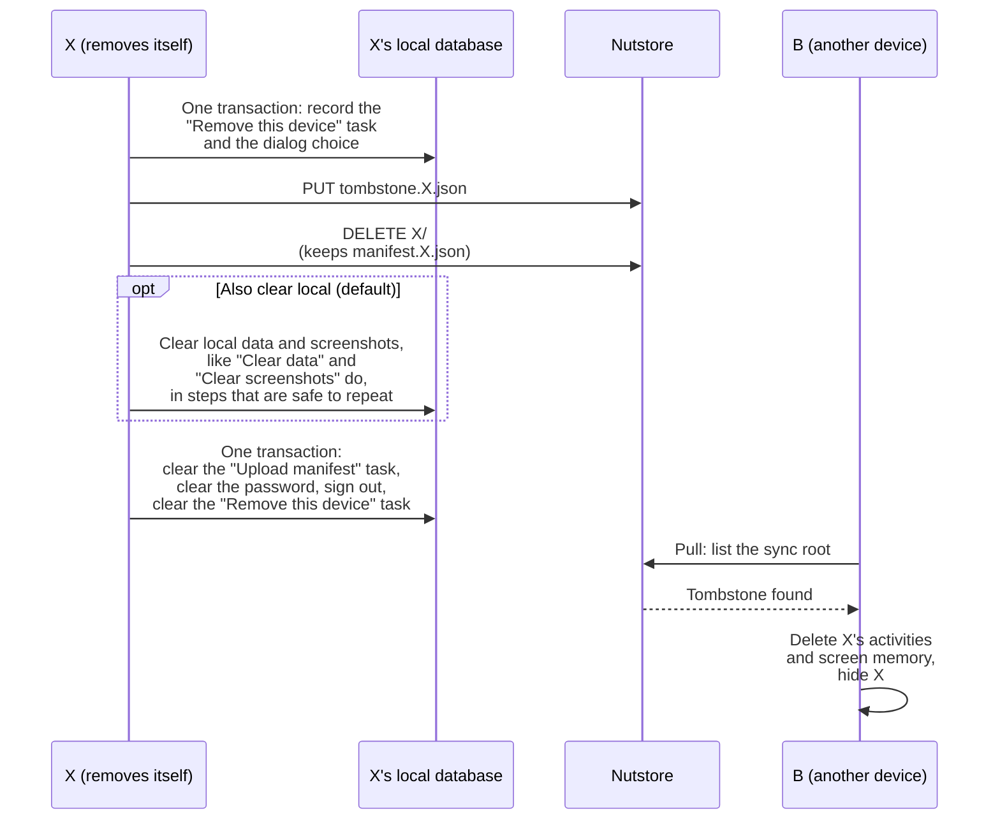
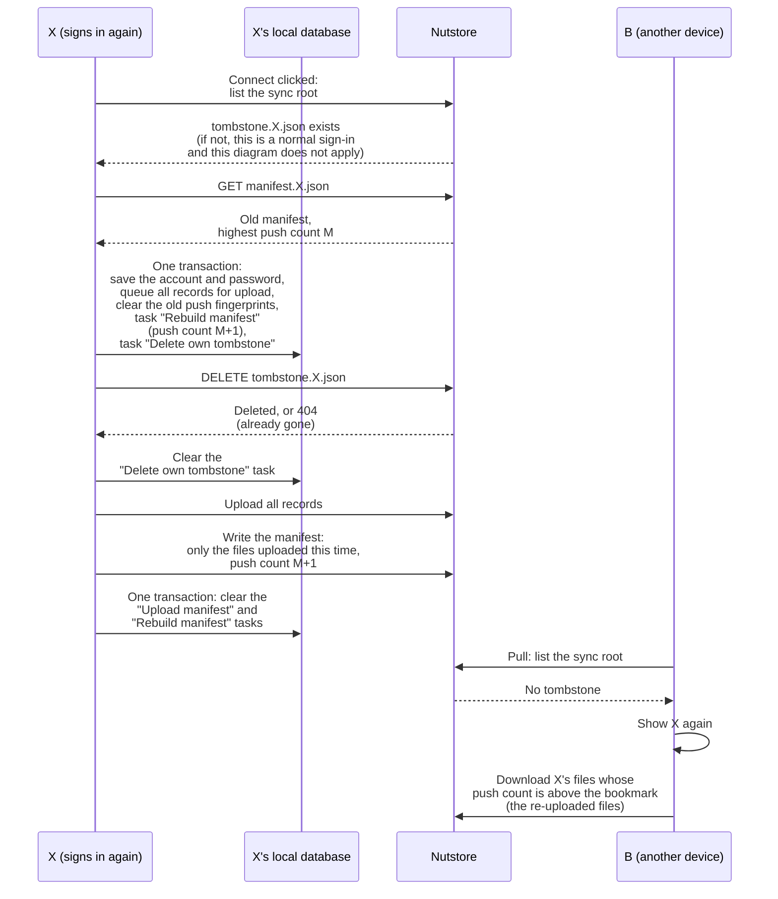

# ADR-0012 · WebDAV: remove a device with a tombstone

- **Date**: 2026-09-28
- **Status**: **Accepted**
- **Related**: ADR-0007 · ADR-0008 · ADR-0009 · ADR-0011 · PR #74 · PR #75

With WebDAV sync (for example Nutstore), an old computer X cannot be removed from the cloud: **Forget X from the cloud** is hidden, and **Settings → Data → Remove this device** is disabled. We will write a small file, the tombstone `tombstone.X.json`, to the sync root to tell every device that X was removed, and delete X's whole data directory with one request. `manifest.X.json` stays in the cloud, so that when X signs in again, other devices download the data it uploads again.

## Flow

### Forget X on A

A may also write the tombstone after X lists the sync root. X then sees no tombstone in this round, and A deletes the files X just uploaded:

### Remove this device on X

> `manifest.X.json` is kept so that, after X signs in again, other devices download the data it uploads again.

### X signs in again

The transaction at connect is written to the database this account actually uses: connecting may switch databases under ADR-0011 (`SwitchDatabase`). The rebuilt manifest does not keep the old file list: X may have cleared its local data while it was removed, so some old files may never be uploaded again. The push count starts at `M+1`, so other devices download the re-uploaded files.

If the sync root has no tombstone for X, this is a normal sign-in: `UpdateCredentials` (ADR-0011) keeps using the old manifest, and there is no full re-upload.

### When a step fails

Every operation first records a **task** in a local transaction, then changes the cloud. At the start of each round, the app finishes this account's unfinished tasks. Every step is safe to repeat: writing the tombstone again gives the same result, and a 404 when deleting the directory or the tombstone counts as done. The task is cleared in the last step. If the operation signs out, clearing the password and clearing the task happen in one transaction, because the cloud requests before it need the password.

| Task | What a retry does |
|---|---|
| A: "Forget X" | Write the tombstone again, delete `X/`, then delete X's activities and screen memory. |
| X: "Remove this device" | Write the tombstone again, delete `X/`, handle local data by the saved choice, then sign out. While the task is pending, X does not treat its own tombstone as "Removed". |
| X: "Removed" | Delete `X/`. Then, in one transaction: clear the "Upload manifest" task, clear the password and sign out, record a notice that the device was removed, and clear the "Removed" task. Local data is kept. |
| X: "Delete own tombstone" | Delete the tombstone. Only after it succeeds or returns 404, clear the task and start uploading again. While the task is pending, X does not treat its own tombstone as "Removed". |

Two more tasks are not in the table:

- **Upload manifest**: an existing mechanism (`PendingChanges`). It is one row in the local database that lists the files uploaded or deleted this round but not yet in the manifest. It is cleared after the manifest is written.
- **Rebuild manifest**: recorded when X signs in again. It makes the next manifest write drop the old file list. After that write, it is cleared in the same transaction as **Upload manifest**.

If the app crashes before the transaction that records a task commits, nothing has changed in the cloud or on the device, and the user can click again. After the commit, it does not matter where it stopped: the next round does all the steps again. Signing in again works the same way. If the app crashes before the transaction commits, the user clicks **Connect** again. If deleting the tombstone fails, the next round retries it first and uploads nothing until the tombstone is gone.

While a "Forget X" or "Remove this device" task is pending, the UI shows "Removing from the cloud". WebDAV deletes the whole directory in one request and gets no file count, so the completion message does not say how many files were deleted.

## Context

Drive already uses tombstones to tell other devices to delete local data. WebDAV sync adds these problems:

- Each device writes only its own manifest (ADR-0008). If A marked X as removed in X's manifest, X would overwrite it in its next round.
- Each round pushes first, then pulls. X may be uploading and learn that it was removed only when it pulls.
- When an upload finds that `X/` does not exist, X recreates it with `MKCOL`. Deleting the directory once from A is not enough.
- Other devices download only files whose push count is above their local bookmark (ADR-0009). When X uploads again later, its push count must continue from the old manifest.
- Nutstore's free plan allows 600 requests per 30 minutes, shared by the whole account. Deleting a year of files one by one takes about 400 requests.

## Decision

We will **write a tombstone file to the sync root and delete the removed device's data directory with one request**.

When X is removed, the device doing it writes `tombstone.X.json` to the sync root with the content `{ "version": 1 }`, then deletes the whole `X/` with one `DELETE`. The tombstone never expires. `manifest.X.json` stays at the sync root. X's data directory and its manifest are separate, so only the data can be deleted.

When another device sees the tombstone, it deletes **all of X's activities and screen memory** on that device, hides X in the device list, and stops downloading X's files. It finds X's rows by `device_id` and `text_sessions.origin_device`, so the deletion is safe to repeat. AI summaries and chat history are shared across devices and are kept.

- Deleting X's activities must not reuse the time filter in `merge_tombstone`.
- The device card is shown or hidden only by whether the tombstone exists, not by time.

## Alternatives

- **A tombstone file at the sync root (chosen)**: every pull lists the sync root first, so devices see it with no extra request.
- **Mark the removal in X's manifest**: X overwrites its own manifest in its next round.
- **Delete X's files one by one**: about 400 requests for a year of files, which hits Nutstore's rate limit. One `DELETE` of `X/` also frees the space at once.
- **Delete X's manifest and copy its push count into the tombstone**: after A reads the manifest, X may push one more round. Devices with a newer bookmark would then skip X's re-uploaded files. Keeping the manifest avoids this: only X writes it, and its highest push count includes X's last round before removal.
- **Change the cloud first and record the task after**: after a crash, nothing shows that the operation is unfinished. A removal could leave `X/` behind, and signing in again could delete the tombstone without uploading again.
- **Check the tombstone again before writing the manifest**: not needed. Each round pushes first, then pulls, so listing the sync root during the pull always comes after this round's uploads. If X sees the tombstone, X deletes `X/` itself. If not, A's later `DELETE X/` deletes those files (see the two diagrams under "Forget X on A"). This depends on push before pull: if the pull ever runs first, a check after the uploads is needed again.

## Consequences

The main trade-off: removal needs no extra requests per round, but the tombstone and X's manifest stay in the cloud, and a few timing cases remain.

- **Benefits**:
  - No extra requests: devices see the tombstone when the pull lists the sync root.
  - One request deletes all of X's files.
- **Costs and risks**:
  - In the first round after removal, X may upload files and then delete them.
  - If X shuts down after uploading and before pulling, the `X/` it recreated stays until X runs again.
  - If X never comes back, the tombstone and the old manifest stay in the cloud (a few KB). ADR-0008 (each device writes only its own manifest) still holds; the one addition is that the removing device deletes X's data directory.
  - Categories and app groups that X changed are not undone by the removal, the same as with Drive.
  - Signing in again deletes the tombstone before uploading again. Until X writes its new manifest, other devices may try to download deleted files listed in the old manifest. These downloads fail and are retried each round.
  - If A removes X again at almost the same moment X signs in again, X's "Delete own tombstone" task may delete A's new tombstone and undo that removal. This is a known race.

## Data, compatibility, security, and privacy

- **Existing data and migration**: no migration. The cloud gets one new kind of file at the sync root.
- **Mixed versions and rollback**: 0.8.27 does not know tombstones and keeps X's old data. A removed X that still runs an old version keeps uploading and recreates `X/`; new versions ignore it. Old versions may also keep trying to download deleted files, so the release notes should ask users to update every device. After X signs in again, old versions download the re-uploaded files by their higher push count. After a rollback, tombstones are ignored.
- **Irreversible effects**: X's data in the cloud, and X's activities and screen memory on other devices, are deleted. If X still has its local data, signing in again uploads it back. If X is lost, the data cannot be recovered. The UI must say this before the removal.
- **Security and privacy**: removal is always started by the user. The tombstone holds only a version number, no device data.

## Verification

- Tests cover a retry after a failure at every step of the four tasks in the table.
- Tests cover both orders of A writing the tombstone and X listing the sync root. In both, no file X uploaded in that round stays in the cloud.
- After X signs in again, its push count continues from the old manifest, and the rebuilt manifest has no deleted old paths.
- On a real device: one directory `DELETE` fully clears `X/` on Nutstore, and another device sees the tombstone in its next round after it is written.
