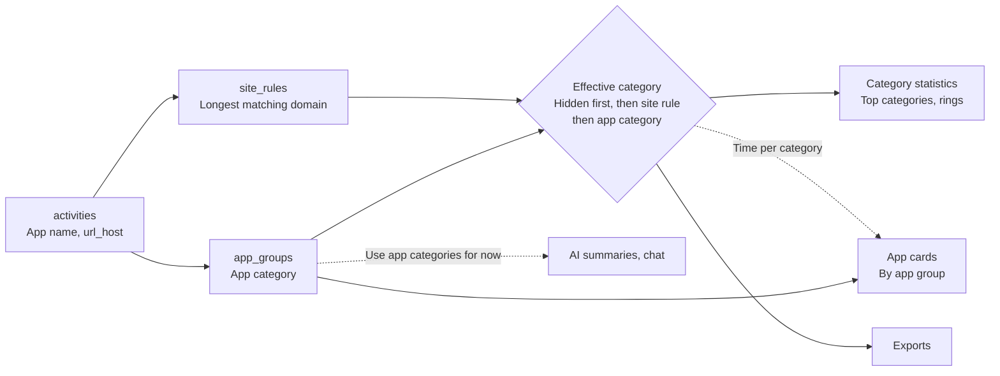
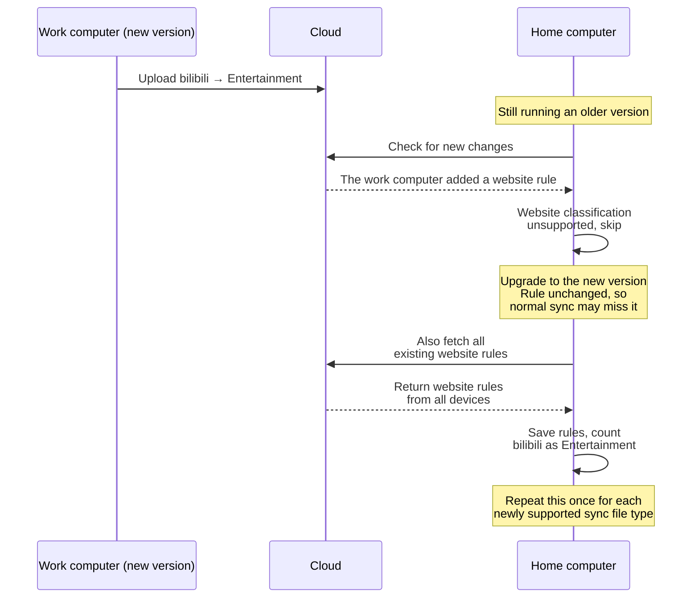

# ADR-0013 · Website category rules: storage and synchronization

- **Date**: 2026-10-07
- **Status**: Proposed
- **Related**: issue #31 · [ADR-0005](0005-push-rewrites-whole-files.md) · [ADR-0006](0006-per-dataset-pull-cursors.md)

Browser activity is categorized by application, so different websites cannot be classified by purpose. This proposal stores website rules separately, applies them when querying statistics, and follows the existing sync approach.

## Architecture

Activity records store facts; website rules are stored separately. Each session's category is resolved when the data is read. App cards still list app groups, using the effective category to obtain each app's time in each category. AI summaries and chat do not adopt website rules in this release.

## Decisions and rationale

1. **Store rules in a separate `site_rules` table.** The unique key is `(host, browser, device)`; the other fields are `category_id`, `updated_at`, and `deleted_at`. Each website's assignment can be changed, synced, or removed independently. Categories themselves remain in `categories`.
2. **Apply only rules that apply to all browsers and all devices in this release.** Both `browser` and `device` use `NOT NULL DEFAULT ''`. Empty strings mean all browsers and all devices. This release only creates and applies rules with both fields empty; rules with non-empty fields are still stored and synced. Defining the rule's identity now reduces the cost of changing the primary key later, at the cost of retaining and filtering two fields this release does not otherwise use. The priority of rules for specific browsers or devices, and how they handle app group changes, are left to a future design.
3. **Classify at query time without rewriting activity records.** Current rules can change historical classifications where domains were recorded. Removing a rule recalculates statistics using the remaining rules, avoiding large history rewrites and sync uploads whenever a rule changes. A hidden browser takes precedence; website rules use the longest matching domain; each session is counted once.
4. **Share one definition of the effective category across statistics and exports; leave AI on the existing definition for now.** Top categories, rings in the Share view, category rankings on the All time page, and the raw data sheet in exports resolve the effective category through one query fragment rather than duplicating the logic. AI summaries and chat tools continue to use app categories. The query fragment they currently share with statistics stays unchanged to avoid unreviewed behavior changes; statistics move to the new one. These two query paths are temporary and will be unified later.
5. **Include rules in core sync.** Rules sync automatically when cloud sync is enabled, without a separate switch. Each device uploads a complete snapshot, `device.<device_id>.site_rules.json` (ADR-0005). Records with the same key are merged by `updated_at`. Removing a rule retains a `deleted_at` marker so other devices remove it too. Deleting a category marks its related rules as deleted in the same transaction.

## Alternatives

| Option | Why rejected |
|---|---|
| Store rules in settings JSON | Settings do not currently sync; merging individual rules and preserving fields unknown to older versions would need additional work |
| Store website lists in categories | Moving a website between categories changes two lists, making uniqueness and concurrent edits harder to manage |
| Treat websites as virtual apps | Websites would enter app management and inherit pairing, renaming, and deletion behavior |
| Write website categories into each activity record | Changing a rule would require updating historical records, increasing writes and sync costs |

## Get existing website rules after an upgrade

The work computer has already upgraded and assigned bilibili to Entertainment. The home computer still runs an older version and skips this rule. Later sync rounds only check new changes. Even after the home computer upgrades, it may never receive this rule if it has not changed again.

After an upgrade, fetch all existing website rules from the cloud once. Fetch only these rules, without downloading activity history again, so history the user cleared does not return.

After all rules have been downloaded and saved successfully, record that the website rules have been fetched and resume syncing only new changes. Retry on failure. Future sync additions, such as super-categories, can use the same approach.

## Costs, data, and compatibility

- **Query cost**: Rule matching adds work; queries on the All time page need measurement. Merging by modification time also inherits the risk of differences between device clocks.
- **Historical data**: Migration v42 only creates an empty table. Rules do not rewrite raw activities. Time recorded without a domain cannot be classified by website. Changes between visible categories preserve total seconds; hiding a website reduces visible time.
- **Mixed versions and rollback**: Older versions use browser categories; newer versions apply website rules, so results may differ. Downgrading retains the rules table but does not apply its rules. Upgrading again makes the stored rules usable.
- **Release scope**: Websites do not appear as separate app rows. Statistics and exports classify the same time differently from AI summaries and chat tools (decision 4). Document this difference in the release notes.
- **Privacy**: Domain-to-category mappings are additional data uploaded to the user's own cloud storage. No new upload of full URLs is introduced.

## Verification

- Count each session once. Changes between visible categories preserve total seconds; hiding a website subtracts its time. Results filtered by category must agree with category totals.
- Sync rule changes, removals, and category deletions. Store and sync rules for specific browsers or devices without applying them in this release.
- Fetch rules skipped by older versions after upgrading. Retry failures and do not repeat the fetch after success. Do not download activity history again. Measure query performance with synthetic data.
