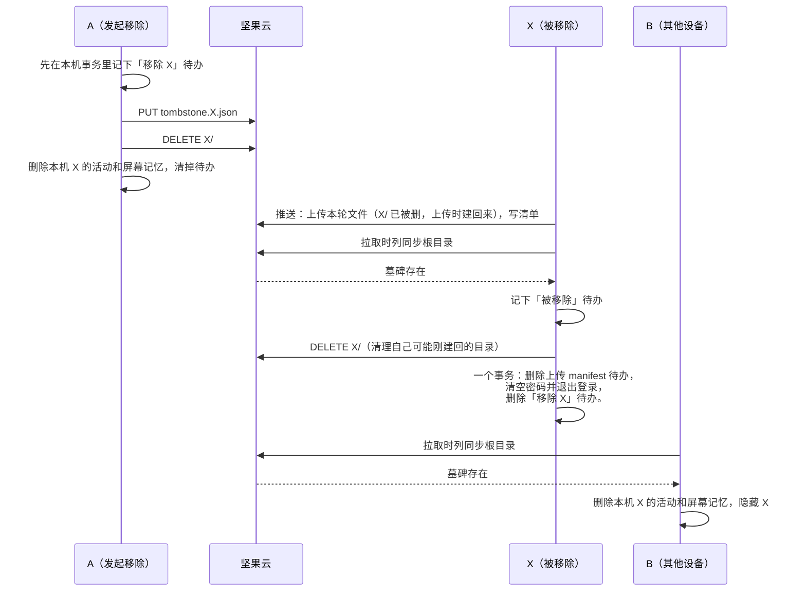
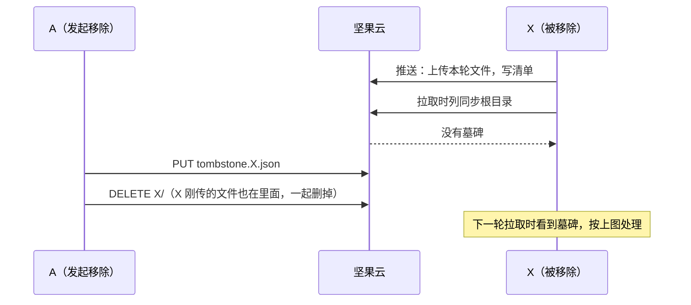
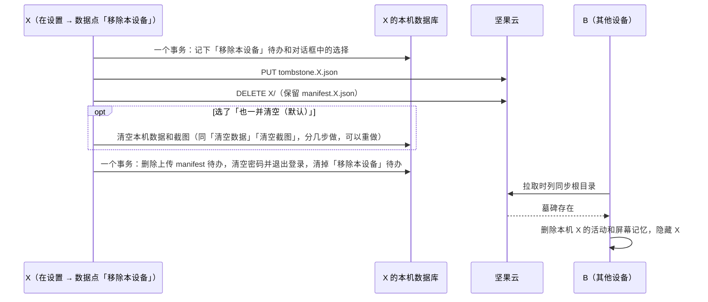
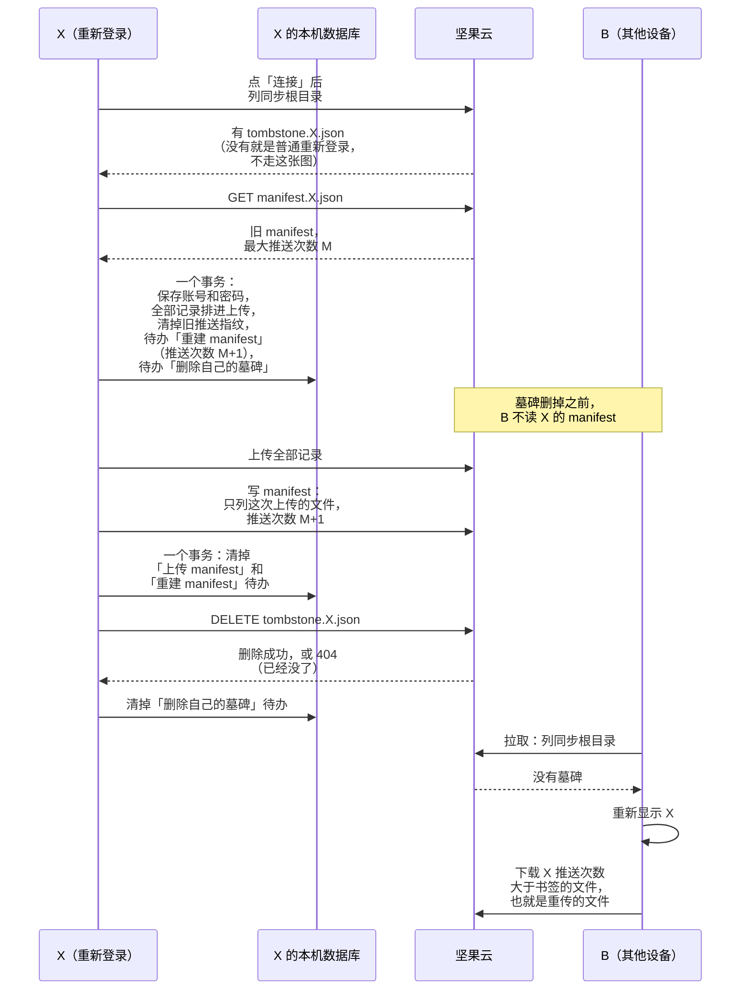

# ADR-0012 · WebDAV：用设备墓碑从云端移除设备（中文稿）

- **日期**：2026-09-28
- **状态**：已接受
- **相关**：ADR-0007 · ADR-0008 · ADR-0011 · PR #74 · PR #75

假设旧电脑 X 不再用了。你在另一台设备 A 上点「从云端移除 X」，希望 X 的云端文件消失，其他设备也不再显示它。现在用坚果云同步时，这个按钮被隐藏；「设置 → 数据」里的「移除本设备」则是灰的。

我们决定在云端放一个小文件，告诉所有设备「X 已被移除」，再删掉 X 的整个数据目录。这个文件叫**墓碑**。`manifest.X.json` 留在云端：X 以后重新登录，重传的数据其他设备才会下载。

## 背景：为什么不能只删文件

Drive 已经用墓碑通知其他设备删除本地数据，但 WebDAV 的同步方式多了几道坎：

- 每台设备只写自己的 manifest（ADR-0008）。A 改 X 的 manifest 来宣布移除，X 下一轮会把它覆盖。
- 每轮先推后拉。X 可能正在上传，到拉取时才知道自己被移除。
- 上传发现 `X/` 不存在时，X 会用 `MKCOL` 把目录建回来。A 删一次目录还不够。
- 其他设备只下载推送次数大于本地书签的文件。X 以后重传时，推送次数必须接着旧 manifest 往上走。
- 坚果云免费版每 30 分钟只有 600 次请求，整个账号共用。逐个删一年的文件大约要四百次请求。

## 决定

移除 X 时，在同步根目录写 `tombstone.X.json`，内容只有 `{ "version": 1 }`，然后用一次 `DELETE` 删掉整个 `X/`。墓碑不过期；`manifest.X.json` 保留在根目录。X 的数据目录和 manifest 分开，所以可以只删数据。

其他设备一看到墓碑，就删除本机属于 X 的**全部活动和屏幕记忆**，从设备列表里隐藏 X，不再下载 X 的文件。删除按 `device_id` 和 `text_sessions.origin_device` 识别来源，可以重复执行。AI 总结和聊天记录是各设备共享的，保留。

### 在 A 上移除 X

A 写墓碑也可能晚于 X 列根目录。这时 X 这一轮看不到墓碑，它刚传的文件由 A 删掉：

### 在 X 上移除本设备

> 保留 `manifest.X.json`，是为了 X 重新登录后，其他设备还会下载它重传的数据。

### X 重新登录

连接时的事务要写进这个账号实际用的数据库：连接可能按 ADR-0011 切换数据库（`SwitchDatabase`）。重建的 manifest 不沿用旧文件列表：移除期间本机可能清过数据，旧文件不一定会重传。推送次数从 `M+1` 开始，其他设备才会下载重传的文件。

根目录没有自己的墓碑，就是普通重新登录：按 ADR-0011 的 `UpdateCredentials` 接着用旧 manifest，不全量重传。

## 中途失败怎么办

每个操作都先在本机事务里记下**待办**，再动云端；每轮开始先处理同一账号未完成的待办。每一步都可以重做：重写墓碑结果不变，删目录或墓碑得到 404 算完成。待办在最后一步清掉；要退出登录的，清空密码和清掉待办在同一个事务里，因为之前的云端请求还要用密码。

| 待办 | 重试时做什么 |
|---|---|
| A「移除 X」 | 重写墓碑、删除 `X/`，再删除本机 X 的活动和屏幕记忆 |
| X「移除本设备」 | 重写墓碑、删除 `X/`，按保存的选择处理本机数据，再退出登录；待办期间看到自己的墓碑，不按「被移除」处理 |
| X「被移除」 | 删除 `X/`，再在一个事务里清掉「上传 manifest」待办、清空密码并退出登录、记下被移除的提示、清掉「被移除」待办；本机数据保留 |
| X「删除自己的墓碑」 | 等「重建 manifest」清掉后才删墓碑，成功或得到 404 后清掉待办；待办期间看到自己的墓碑，不按「被移除」处理 |

表外还有两个待办：

- 「上传 manifest」：现有机制，本机数据库里的一行，记着本轮已上传或删除、还没写进 manifest 的文件；manifest 写成功后清掉。
- 「重建 manifest」：重新登录时记下，让下一次写 manifest 不沿用旧文件列表；写成功后和「上传 manifest」在同一个事务里清掉。

记待办的事务提交前崩溃：云端和本机都没变，重新点一次即可。提交后停在哪一步都没关系，下一轮从头重做。重新登录同理：事务提交前崩溃，重新点「连接」；提交后停在哪一步，下一轮接着做，墓碑留到最后才删。

「移除 X」「移除本设备」待办没做完时，界面显示「正在从云端移除」。WebDAV 一次删整个目录，拿不到文件数，完成提示不写删了几个文件。

## 为什么选这套做法

- **保留 X 的 manifest**：只有 X 写它，最大推送次数包含移除前最后一轮。重新登录时从这里接着计数，别的设备不会因为书签跳过重传的文件。
- **删除整个目录**：一次请求删掉所有文件，云端空间真正释放；逐个删容易撞上坚果云限流。
- **墓碑独立放在根目录**：拉取第一步就列根目录，不用多发请求就能看到。写进 X 的 manifest 会被 X 覆盖。
- **先记待办**：先改云端再记本机状态的话，崩溃后不知道操作没做完：移除可能留下 `X/`，重新登录可能沿用旧 manifest 的文件列表。
- **重新登录最后删墓碑**：墓碑在的时候，其他设备不读 X 的 manifest。X 重传、写 manifest 失败了重做几次都没人看到；删掉墓碑时新 manifest 已经写好，其他设备一次看到完整结果。先删墓碑的话，写完 manifest 后崩溃重做，推送次数还是 `M+1`，书签已到 `M+1` 的设备会跳过；其他设备还会按旧 manifest 下载已删的文件而报错。
- **不单独查墓碑**：每轮先推后拉，拉取时列根目录一定在本轮上传之后。看到墓碑，X 自己删 `X/`；没看到，A 之后的 `DELETE X/` 会删掉这些文件（见「在 A 上移除 X」的两张图）。这依赖先推后拉；改成先拉后推，就要在上传后再查一次墓碑。

让 A 删掉 X 的 manifest、把推送次数抄进墓碑不可靠：A 读完后 X 可能又推了一轮，书签较新的设备会跳过重传。

## 后果与边界

- 不增加请求：墓碑在拉取列根目录时顺带看到。移除后的第一轮，X 可能先上传文件再删掉。
- X 上传后、拉取前关机的话，它建回来的 `X/` 要等它下次运行才删。
- X 不再回来时，墓碑和旧 manifest 一直留在云端，占几 KB。ADR-0008「每台设备只写自己的 manifest」仍成立；移除时 A 额外删除 X 的数据目录。
- X 改过的分类和应用分组不会因移除而撤销，和 Drive 一样。
- 重新登录时墓碑留到重传完成才删；被限流的话要好几轮，这期间所有设备都隐藏 X。
- X 删掉墓碑、还没清掉待办就崩溃，A 恰好这时再次移除 X：X 重试时会删掉 A 的新墓碑，撤销这次移除。重传期间 A 看不到 X，点不了移除，只剩这个很小的窗口。这是已知的并发风险。

## 数据、兼容、安全和隐私

- **迁移**：不用迁移已有数据。云端只多一种根目录文件。
- **旧版设备**：0.8.27 不认墓碑，会继续保留 X 的旧数据。被移除的 X 若仍运行旧版，还会上传并重建 `X/`；新版设备会忽略它。旧版也可能反复尝试下载已删除的文件。因此发版说明应要求所有设备升级。X 重新登录后，旧版可以按递增的推送次数下载重传的文件；回退旧版时墓碑会被忽略。
- **不可逆的数据删除**：云端 X 的数据和其他设备上 X 的活动、屏幕记忆会删除。如果 X 的本机数据还在，重新登录可以传回来；如果 X 已丢失，这些数据就无法找回。移除前界面要说清楚。
- **安全和隐私**：移除由用户明确发起；墓碑只含版本号，不含设备数据。

## 实现与验证

- 删除本机 X 的活动不能复用 `merge_tombstone` 按时间过滤的条件；设备卡片只按墓碑是否存在决定显示，不按时间恢复。
- 测试覆盖表中四种待办在每一步失败后的重试，以及 A 写墓碑在 X 列根目录之前、之后两种顺序：两种顺序下云端都不留 X 本轮上传的文件。重新登录后推送次数接着旧 manifest，重建的 manifest 里没有已删除的旧路径；写完 manifest、删墓碑之前崩溃，重做后其他设备仍能下载全部重传的文件。
- 真机验收时，确认坚果云的 `X/` 能通过一次目录删除清干净，另一台设备在墓碑写入后的下一轮就能看到它。
