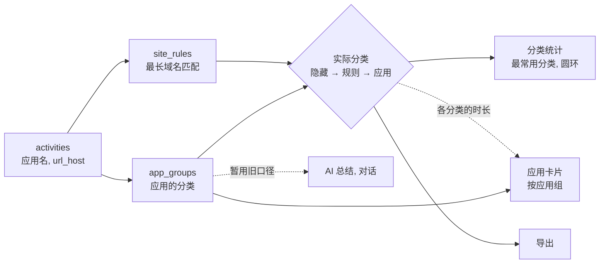
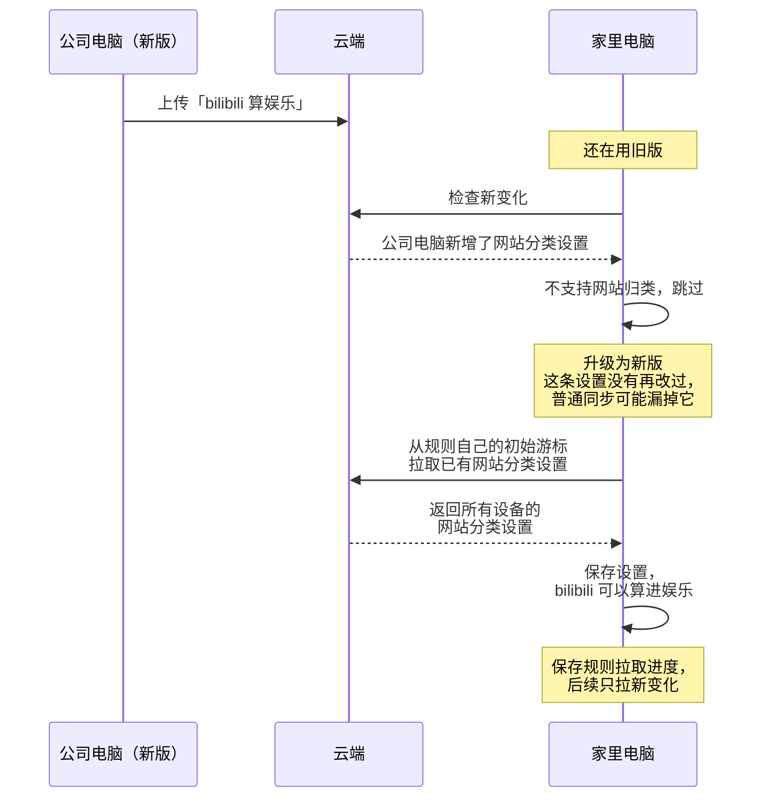

# ADR-0013 · 网站分类规则的存储与同步（中文稿）

- **日期**：2026-10-07
- **状态**：提议中
- **相关**：issue #31 · [ADR-0005](../0005-push-rewrites-whole-files.md) · [ADR-0006](../0006-per-dataset-pull-cursors.md)

浏览器按应用分类，无法区分不同网站的用途。本提案独立保存网站规则，在统计查询时使用，并沿用现有同步方式。

## 架构

活动记录只存事实，网站规则单独保存；一段时间算哪个分类，在读取时才算出来。应用卡片仍按应用组列，只从实际分类里取每个应用在各分类的时长。AI 总结和对话这次不接入。

## 决定与理由

1. **用独立的 `site_rules` 表保存规则。** 唯一键是 `(host, browser, device)`，其余字段为 `category_id`、`updated_at`、`deleted_at`。每个网站的归类可以独立修改、同步和取消，分类本身仍由 `categories` 管理。
2. **本版只使用通用规则。** `browser`、`device` 都是 `NOT NULL DEFAULT ''`，空字符串表示所有浏览器、所有设备。本版只创建和使用两列都为空的规则；非空规则仍保存、同步。提前固定规则标识，减少未来扩展时修改主键的成本，代价是本版需要保留和过滤两个暂不用的字段；专用规则的优先顺序和应用组变更如何处理，留给后续设计。
3. **查询时归类，不回写活动记录。** 当前规则可以改变已有域名记录的历史分类，取消后按剩余规则重新计算，避免每次改规则都重写、同步大量活动。浏览器隐藏优先，网站规则取最长域名匹配，每段时间只计一次。
4. **统计和导出共用一个「实际分类」定义，AI 暂不接入。** 最常用分类、占比圆环、全部历史的分类排行、导出的明细表都通过同一个查询片段取实际分类，不在各处各写一遍。AI 总结、对话仍用应用的分类：它们现在跟统计共用的那个查询片段这次不改，统计改用新的，避免未经检查的行为变化。两套写法是已知的临时状态，以后合并成一个。
5. **启用云同步后自动同步规则。** 规则使用独立、始终启用的拉取流，不设独立开关。每台设备上传完整规则快照 `device.<设备 id>.site_rules.json`（ADR-0005），同一键按 `updated_at` 合并。取消规则保留 `deleted_at` 标记，让其他设备也能取消；删除分类时，在同一事务中取消相关规则。

## 替代方案

| 方案 | 不采用的原因 |
|---|---|
| 放进设置 JSON | 现有设置不参与同步，还需要另做逐规则合并和旧版本字段保留 |
| 在分类里保存网站列表 | 网站换分类涉及两个列表，网站唯一性和并发修改更难处理 |
| 把网站当成虚拟应用 | 会进入现有应用管理，牵涉配对、重命名、删除等应用行为 |
| 把网站分类写回每条活动 | 改规则要更新历史记录，增加写入和同步成本 |

## 旧电脑升级后，怎样拿到之前的网站分类

公司电脑已经升级，设置了「bilibili 算娱乐」。家里电脑还在用旧版，会跳过这条设置，共享的拉取游标也已越过这个文件。升级后，如果仍沿用这个游标，而规则文件没有变化，就会继续漏掉它。

网站规则使用独立、始终启用的拉取流（ADR-0006）。新游标不存在时默认从 1970 开始，所以升级后的首次拉取能收到已有规则。活动历史沿用自己的进度，避免把用户清掉的历史又下载回来。

规则的拉取进度按后端分别保存：Drive 使用 `pull.site_rules`，WebDAV 在这个名字前加现有后端前缀。复用原有流程，只越过已处理的文件，失败的文件下次重试。每个流的游标只向前推进，即使其他流列出了更旧的文件也不回退。以后新增同步内容，也可以使用独立游标。

## 代价、数据与兼容

- **查询成本**：增加规则匹配；「全部历史」需要实测。按修改时间合并也沿用设备时钟偏差的风险。
- **历史数据**：迁移 v42 只新建空表。规则不改原始活动；没有记录域名的时间无法补出网站归类。普通归类保持总秒数，隐藏会减少可见时间。
- **混用与回退**：旧版仍按浏览器分类，新版使用网站规则，结果可能不同。回退旧版时规则表保留但不生效，重新升级后可继续使用。
- **本版范围**：应用列表不单列网站。统计页、导出和 AI 总结、对话对同一段时间的分类会不同（决定 4），差异写进发版说明。
- **隐私**：新增上传域名与分类关系，存入用户自己的云端；不新增完整网址上传。

## 验证

- 分类只计一次，普通归类总秒数不变，隐藏扣掉对应时间；分类筛选结果与分类合计一致。
- 规则修改、取消、分类删除能同步；非空浏览器或设备规则能保存同步，但本版不使用。
- 升级能补读旧版跳过的规则，失败可重试，成功后不重复；补读不重新下载活动历史。用合成数据验证查询耗时。
