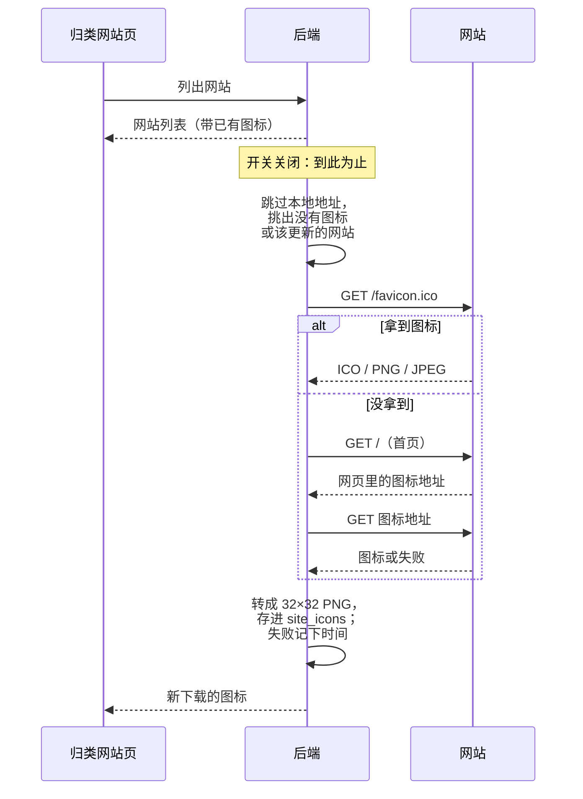

# ADR-0014 · 网站图标从网站下载、存在本机（中文稿）

- **日期**：2026-10-09
- **状态**：提议中
- **相关**：issue #31 · [ADR-0013](0013-site-category-rules.md)

「归类网站」页只有网址，认网站要一个个读。本提案在用户打开开关后，由 Hindsight 直接向网站请求图标，存在本机，不同步。开关默认关闭。

## 流程

| 情况 | 结果 |
|---|---|
| 开关关闭 | 不发任何请求；已经下载的图标照常显示 |
| `localhost`、IP 地址、`.local` 结尾、没有点的主机名 | 跳过，不请求 |
| 下载成功 | 存起来，30 天后再更新一次 |
| 下载失败或格式不支持（如 SVG） | 记下失败时间，7 天内不再试；页面显示地球图标 |
| 「清除数据」 | 跟活动记录一起删掉 |

## 决定与理由

1. **从网站本身下载。** 所有浏览器走同一条路，不用处理每个浏览器的图标缓存。代价是 Hindsight 会主动联网。
2. **开关默认关闭，打开时说明会访问哪些网站。** 不打开就没有新的网络请求，跟以前的行为一致。说明里写明：公司内网里看起来像普通域名的地址认不出来，也会被访问。
3. **跳过本地地址。** 本地开发服务和局域网设备的图标没有用，请求它们也可能有副作用。
4. **存在本机的 `site_icons` 表，不同步。** 每台设备打开开关后自己下载，同步格式不变。
5. **只认 ICO、PNG、JPEG。** SVG 要另加一个很大的依赖，这些网站继续显示地球图标。
6. **`/favicon.ico` 拿不到时，读首页里声明的图标地址。** 20 个常见网站实测，4 个拿不到 `/favicon.ico`：2 个没放（404），1 个跳到登录页（返回 HTML），1 个被防爬虫拦下（403）。读首页预计能补上前 3 个（未实测），被拦的拿不到。不管从哪一步拿到，都检查内容是不是图片，不只看状态码。

## 替代方案

| 方案 | 不采用的原因 |
|---|---|
| 读浏览器自己的图标缓存 | 要分别处理每个浏览器在 mac、Windows 上的文件位置和被锁住的文件；Safari 的缓存要「完全磁盘访问权限」 |
| 用第三方图标服务 | 会把用户访问过的所有域名发给第三方 |
| 图标随云同步 | 要改同步格式；每台设备都能自己下载 |

## 代价、数据与兼容

- **隐私**：网站会收到来自本机的请求，跟用浏览器访问时一样会看到 IP；不同的是请求在后台发出，时间跟浏览无关。
- **网络**：每个网站第一次和之后每 30 天各请求一次；失败的每 7 天最多再试一次。
- **存储**：迁移 v43 新建空表。一张图标一两 KB，一千个网站约两三 MB。
- **回退**：旧版本不认识这张表，留着不用；重新升级后图标还在。

## 验证

- 开关关闭时不发任何请求。
- 本地地址不请求。
- `favicon.ico` 拿不到时从首页找图标地址；都失败后 7 天内不再试。
- ICO、PNG、JPEG 都能转成 32×32 PNG；SVG 记为失败。
- 「清除数据」后 `site_icons` 为空。
