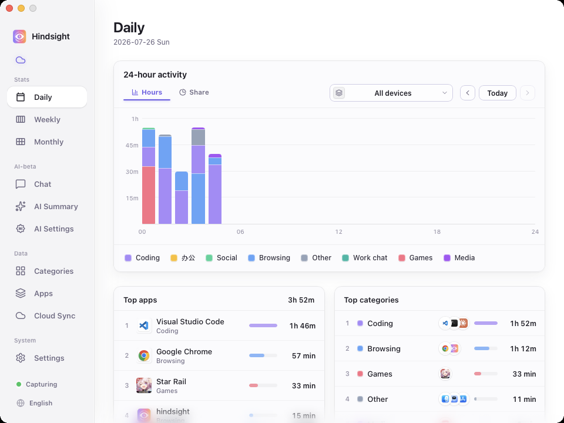
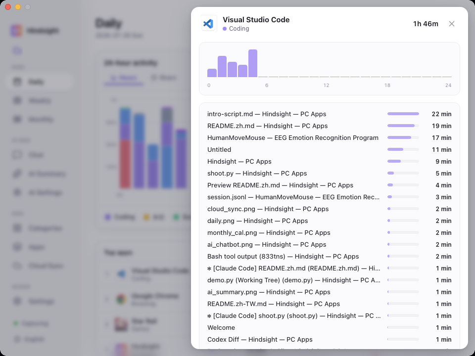
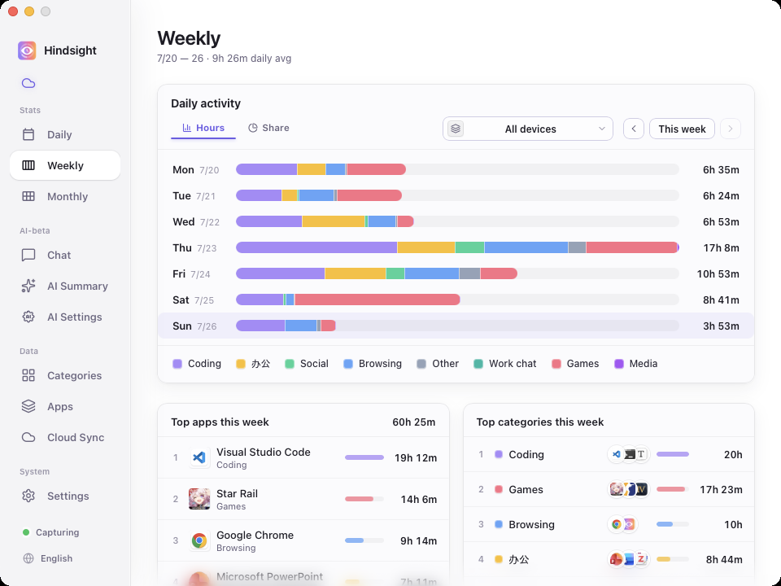
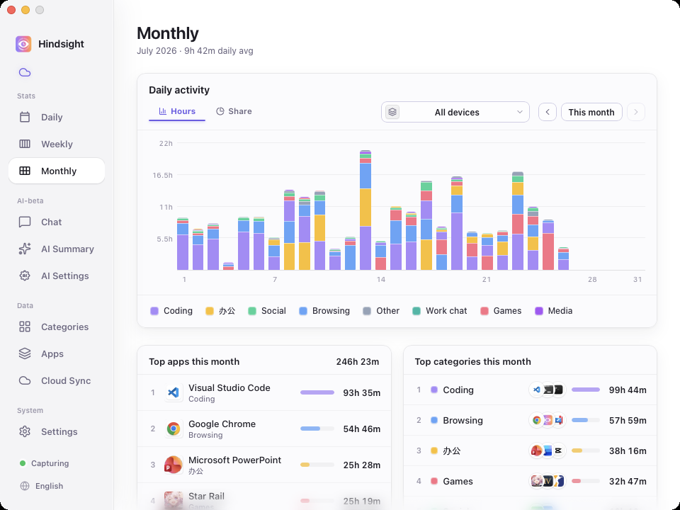
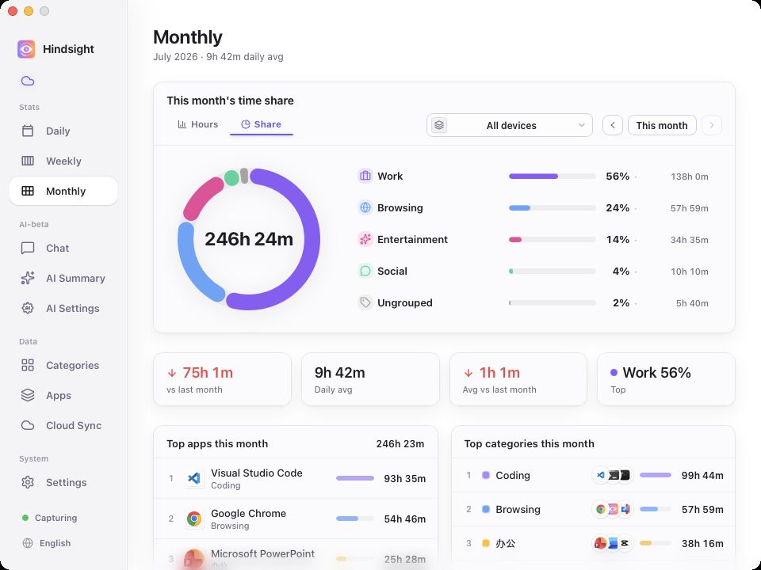
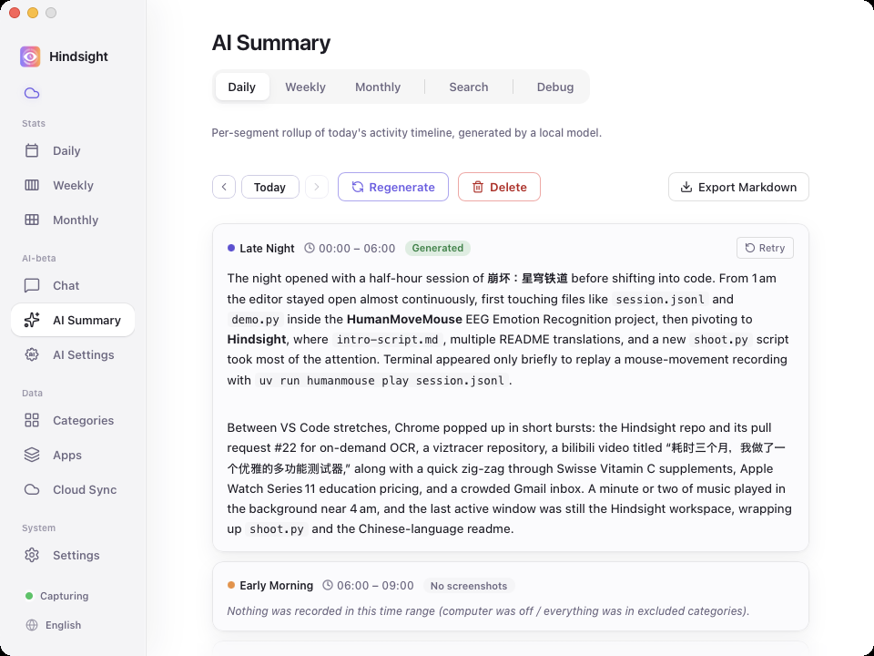
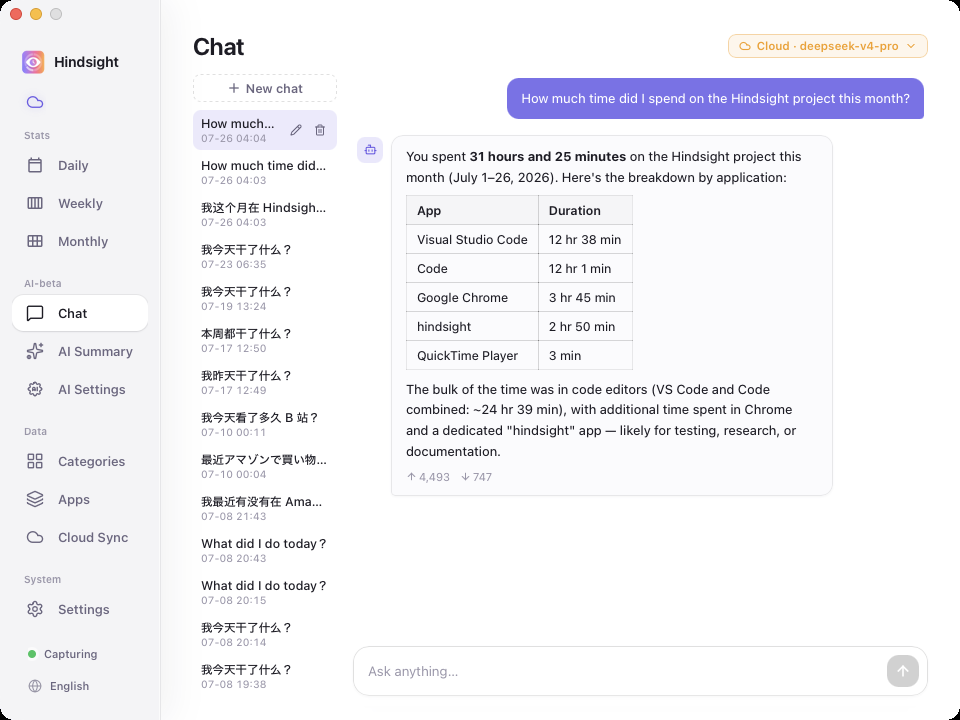
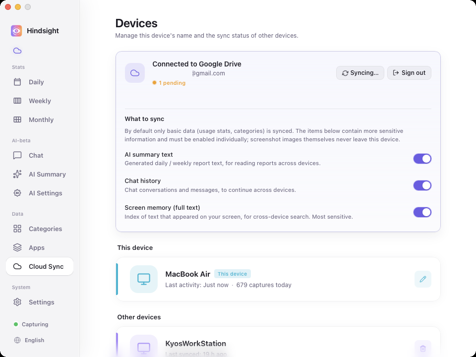

  

<h1 align="center">Hindsight</h1>

  <strong>Una herramienta de registro de actividad del ordenador y análisis con IA que prioriza el almacenamiento local</strong> 
  Registra automáticamente la actividad de aplicaciones y ventanas y muestra cómo has distribuido tu tiempo por día, semana y mes, sin temporizadores manuales ni etiquetas de proyecto que mantener.

  <a href="../zh/README.md">简体中文</a> · <a href="../zh-TW/README.md">繁體中文</a> · <a href="../../../README.md">English</a> · <a href="../ja/README.md">日本語</a> · <a href="../pt/README.md">Português</a> · <a href="README.md">Español</a>

  
  
  
  

  
  

  <a href="https://github.com/Tomotsugu-dev/Hindsight/releases"><b>Descargar la última versión</b></a> ·
  <a href="#vista-previa-de-la-interfaz">Vista previa de la interfaz</a> ·
  <a href="#funciones-principales">Funciones principales</a> ·
  <a href="#inicio-rápido">Inicio rápido</a>

---

## Vista previa de la interfaz

  <video src="https://github.com/user-attachments/assets/169515ed-a9bd-40fe-ba46-7c9c45e5cc95" controls muted autoplay loop playsinline width="800"></video>

  <b>Vista previa de la aplicación</b> · Las interacciones principales de Hindsight en 1 minuto

   
  <b>Estadísticas diarias</b> · Cronología apilada de 24 horas y clasificaciones por aplicación y categoría: descubre de un vistazo en qué has empleado el día

   
  <b>Detalle de la aplicación</b> · Haz clic en cualquier aplicación para ver qué estabas haciendo en ella

   
  <b>Estadísticas semanales</b> · Toda tu semana de un vistazo

   
  <b>Estadísticas mensuales</b> · Barras de actividad diaria con clasificaciones por aplicación y categoría: descubre en qué has empleado realmente el tiempo este mes

   
  <b>Desglose mensual</b> · Proporción de tiempo por categoría, con el total, la media diaria y la variación respecto al mes anterior

   
  <b>Informe diario con IA</b> · Un modelo local o en la nube resume cada franja del día en un informe escrito

   
  <b>Chat con IA</b> · Solo tienes que preguntar, por ejemplo: «¿Cuánto tiempo he dedicado a X este mes?»

   
  <b>Sincronización entre dispositivos</b> · Para quienes usan más de un ordenador

## Funciones principales

- 📊 **Descubre en qué empleas tu tiempo** — Registro automático en segundo plano con histogramas por franja horaria y clasificaciones de aplicaciones; resúmenes diarios, semanales y mensuales. Haz clic en cualquier aplicación para ver el detalle por título de ventana; categorías personalizables («Trabajo / Entretenimiento / Aprendizaje»)
- 🤖 **Informe diario con IA** — Un modelo local redacta un informe de cada franja del día; al activar el resumen automático, se generan automáticamente el informe diario de ayer y el informe semanal de la semana pasada
- 💬 **Chat con IA** — Pregunta «¿Qué he hecho hoy?» o «¿Cuánto tiempo he dedicado al proyecto X este mes?» y recibe respuestas basadas en tus propios registros
- 🔍 **Búsqueda en el historial de pantalla** — Encuentra cualquier texto que haya aparecido en tu pantalla y accede a la captura y al momento correspondiente (las capturas de pantalla y el OCR están desactivados por defecto; actívalos según lo necesites)
- ☁️ **Vista conjunta de varios dispositivos** — Sincronización opcional de los datos de actividad mediante Google Drive; consulta todos tus ordenadores en un solo lugar (las capturas de pantalla nunca salen del dispositivo)
- 🔒 **Almacenamiento local y privacidad ante todo** — Tus datos permanecen en tu equipo por defecto

## Por qué Hindsight

¿Alguna vez has cerrado el portátil a medianoche con la sensación de haber «trabajado todo el día», pero sin poder decir qué habías conseguido realmente? Hace un tiempo empecé a buscar una herramienta de seguimiento para resolver precisamente eso. Probé unas cuantas, pero ninguna me convenció:

- **[ActivityWatch](https://github.com/ActivityWatch/activitywatch)** — Es de código abierto, prioriza la privacidad y, técnicamente, cumple todos los requisitos. Mi opinión sincera: la interfaz no me atrae. Lo instalaba, lo miraba una vez y no volvía a abrirlo.
- **[WorkReview](https://github.com/wm94i/Work-Review)** — No encontré ninguna herramienta que ofreciera a la vez (a) una vista de varios dispositivos y (b) una cronología por horas como Tiempo de uso del iPhone. Quería de verdad esa vista con zoom para saber «qué estaba haciendo a las tres de la tarde» en el ordenador, y ninguna lo hacía como yo quería.
- **[Toggl](https://toggl.com) / [RescueTime](https://www.rescuetime.com) / SaaS de pago** — Parecen pensados para equipos y para el seguimiento de «horas facturables» al estilo de recursos humanos. Los paneles están saturados, el flujo de trabajo gira en torno a etiquetar proyectos y los datos se almacenan en servidores ajenos. No son la herramienta adecuada para entender tus propios hábitos.

Creé Hindsight para cubrir precisamente esas carencias.

## Inicio rápido

Descarga el instalador para tu plataforma desde [Versiones](https://github.com/Tomotsugu-dev/Hindsight/releases) e instálalo.

### Windows

Descarga `hindsight_x.y.z_x64-setup.exe` y haz doble clic para instalarlo.

> ⚠️ **Al ejecutarlo por primera vez aparecerá el aviso «Windows protegió su PC»** — El instalador todavía no está firmado con un certificado de firma de código EV, por lo que SmartScreen lo bloqueará. Haz clic en «Más información» → «Ejecutar de todas formas» para continuar.

### macOS

Descarga `hindsight_x.y.z_universal.dmg` (binario universal para Apple Silicon e Intel), haz doble clic para montar la imagen y arrastra Hindsight a la carpeta Aplicaciones. La aplicación está firmada con un certificado de desarrollador de Apple y notarizada por Apple, por lo que se abre normalmente sin avisos de Gatekeeper.

> Todos los datos de actividad y las capturas de pantalla se almacenan localmente por defecto. Si activas la sincronización con Google Drive, solo se subirán los metadatos de actividad; **las capturas de pantalla no se subirán**.

## Licencia

  Este proyecto es de código abierto y se distribuye bajo la <a href="../../../LICENSE"><b>Licencia MIT</b></a>. Puedes usarlo, modificarlo y distribuirlo libremente. 
  © 2026 colaboradores de Hindsight

